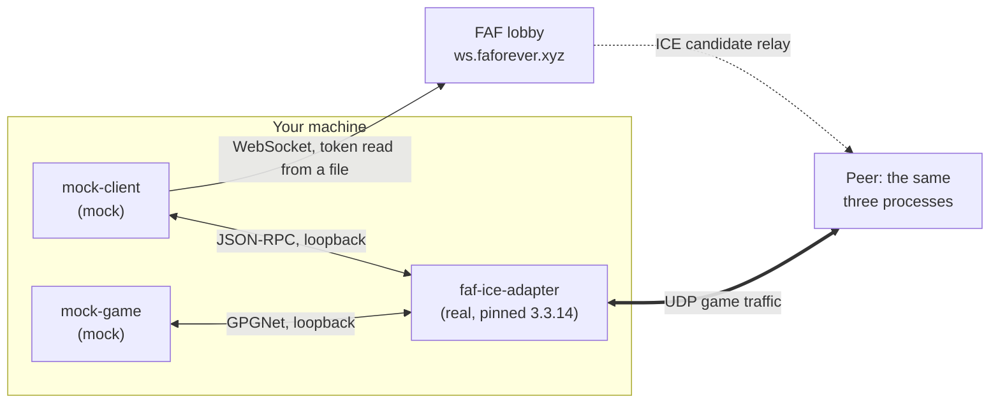

# faf-test-harness

A headless CLI test harness for [Forged Alliance Forever](https://github.com/FAForever).
Testing any one FAF component has always meant standing up the others: you cannot
exercise the lobby server without a client, and the ICE adapter's peer-connection path
needs two games and two clients behind it. This harness supplies the missing halves as
scriptable processes, so a component can be tested on its own, unattended, in CI.

It is for the people who maintain those components. **Mock Client** stands in for the
[FAF client](https://github.com/FAForever/downlords-faf-client): it authenticates against
the lobby over WebSocket, hosts or joins a game, launches a real
[`faf-ice-adapter`](https://github.com/FAForever/java-ice-adapter) subprocess, and relays
ICE signalling. **Mock Game** stands in for the Supreme Commander binary, the one
component FAF has never replaced: it speaks the real GPGNet wire protocol to the adapter,
simulates a match, and reports a result. Both are driven by flags and exit codes.

## What it can test

Every row is a shipped command or flag. The account column is what the row needs, not
what the harness needs overall: more than half of this runs on localhost with no FAF
account at all.

| Capability | Command or flag | FAF account |
| :--- | :--- | :--- |
| Is a local adapter reachable | [`ice-smoke`](mock-client/README.md#subcommands) | no |
| An adapter to talk to, and a GPGNet handshake by hand | [`launch-ice`, `launch-game`](mock-client/README.md#subcommands) | no |
| GPGNet handshake against an adapter you started | [`mock-game`](mock-game/README.md) on its own | no |
| One client through the live lobby | [`run`](mock-client/README.md#subcommands) | yes |
| Matchmaking queue | [`run --queue-name`, `--queue-faction`](mock-client/README.md#field-reference) | yes |
| Multi-peer session: full mesh, two-way game traffic | [`session --peers`](mock-client/README.md#subcommands), verified at 2 to 4, accepts up to 26 | one per peer |
| ICE signalling delay | [`--ice-relay-delay-ms`](documentation/operations/harness-runbook.md#10-fault-injection-wbs-51-52) | yes |
| UDP packet loss | [`--udp-drop-percent`](documentation/operations/harness-runbook.md#10-fault-injection-wbs-51-52), or `--mock-game-udp-drop-percent` to inject it through a session | no on its own, yes through a session |
| Game crash | [`--crash-after-seconds`](documentation/operations/harness-runbook.md#10-fault-injection-wbs-51-52), or `--mock-game-crash-after-seconds` to inject it through a session | no on its own, yes through a session |
| Token-file login, refresh or pre-signed access | [`--oauth-refresh-token-file`, `--oauth-access-token-file`](documentation/operations/harness-runbook.md#3-credentials) | yes |

To localise a failure rather than choose a capability, use
[`component-isolation.md`](documentation/operations/component-isolation.md): it is the
matrix that peels one seam at a time off a failing end-to-end run.

## How it fits together

Every player's machine runs those same three processes. The lobby relays ICE candidates
during negotiation and never sees game traffic. The full symmetric version, with protocol
labels sourced from the research specs, is in
[`documentation/diagrams/architecture.md`](documentation/diagrams/architecture.md).
