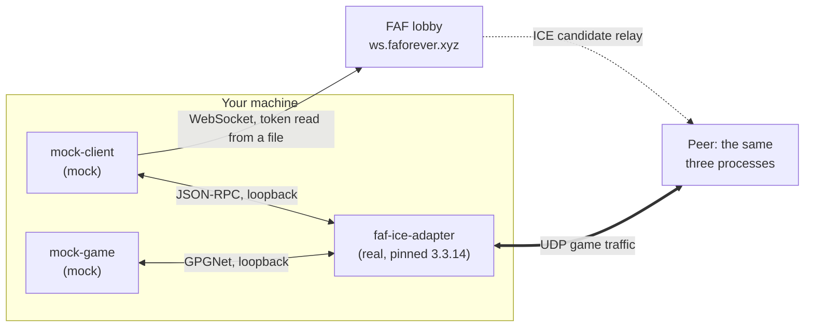

# faf-test-harness

[](https://github.com/md-173/faf-test-harness/actions/workflows/ci.yml)
[](https://github.com/md-173/faf-test-harness/releases/latest)
[](LICENSE)
[](https://adoptium.net/temurin/releases/?version=21)

A headless CLI test harness for [Forged Alliance Forever](https://github.com/FAForever).
Testing any one FAF component has always meant standing up the others: you cannot
exercise the lobby server without a client, and the ICE adapter's peer-connection path
needs two games and two clients behind it. This harness supplies the missing halves as
scriptable processes, so a component can be tested on its own, unattended, in CI.

It is for the people who maintain those components. **Mock Client** stands in for the
[FAF client](https://github.com/FAForever/downlords-faf-client): it authenticates against
the lobby over WebSocket, hosts or joins a game, launches a real
[`faf-ice-adapter`](https://github.com/FAForever/java-ice-adapter) subprocess, and relays
ICE signalling. **Mock Game** stands in for the Supreme Commander binary, the one
component FAF has never replaced: it speaks the real GPGNet wire protocol to the adapter,
simulates a match, and reports a result. Both are driven by flags and exit codes.

## What it can test

Every row is a shipped command or flag. The account column is what the row needs, not
what the harness needs overall: more than half of this runs on localhost with no FAF
account at all.

| Capability | Command or flag | FAF account |
| :--- | :--- | :--- |
| Is a local adapter reachable | [`ice-smoke`](mock-client/README.md#subcommands) | no |
| An adapter to talk to, and a GPGNet handshake by hand | [`launch-ice`, `launch-game`](mock-client/README.md#subcommands) | no |
| GPGNet handshake against an adapter you started | [`mock-game`](mock-game/README.md) on its own | no |
| One client through the live lobby | [`run`](mock-client/README.md#subcommands) | yes |
| Matchmaking queue | [`run --queue-name`, `--queue-faction`](mock-client/README.md#field-reference) | yes |
| Multi-peer session: full mesh, two-way game traffic | [`session --peers`](mock-client/README.md#subcommands), verified at 2 to 4, accepts up to 26 | one per peer |
| ICE signalling delay | [`--ice-relay-delay-ms`](documentation/operations/harness-runbook.md#10-fault-injection-wbs-51-52) | yes |
| UDP packet loss | [`--udp-drop-percent`](documentation/operations/harness-runbook.md#10-fault-injection-wbs-51-52), or `--mock-game-udp-drop-percent` to inject it through a session | no on its own, yes through a session |
| Game crash | [`--crash-after-seconds`](documentation/operations/harness-runbook.md#10-fault-injection-wbs-51-52), or `--mock-game-crash-after-seconds` to inject it through a session | no on its own, yes through a session |
| Token-file login, refresh or pre-signed access | [`--oauth-refresh-token-file`, `--oauth-access-token-file`](documentation/operations/harness-runbook.md#3-credentials) | yes |

To localise a failure rather than choose a capability, use
[`component-isolation.md`](documentation/operations/component-isolation.md): it is the
matrix that peels one seam at a time off a failing end-to-end run.

## How it fits together



Every player's machine runs those same three processes. The lobby relays ICE candidates
during negotiation and never sees game traffic. The full symmetric version, with protocol
labels sourced from the research specs, is in
[`documentation/diagrams/architecture.md`](documentation/diagrams/architecture.md).

## Quick start

Both mocks ship as self-contained jars on the
[releases page](https://github.com/md-173/faf-test-harness/releases/latest). Fetch the
pair:

```bash
curl -s https://api.github.com/repos/md-173/faf-test-harness/releases/latest \
  | grep -o '"browser_download_url": *"[^"]*-all\.jar"' \
  | cut -d'"' -f4 \
  | xargs -n1 curl -sfLO
```

That leaves `mock-client-<version>-all.jar` and `mock-game-<version>-all.jar` in the
working directory. To verify the download against the published checksums, see
[runbook §2a](documentation/operations/harness-runbook.md#2a-the-jar-only-path-no-clone).

### Without a FAF account

Two paths run on localhost alone. Both also need the real adapter,
`faf-ice-adapter-3.3.14-nojfx.jar` from
[java-ice-adapter](https://github.com/FAForever/java-ice-adapter/releases/tag/3.3.14).

**Is a local adapter reachable?**

```bash
java -jar mock-client-<version>-all.jar ice-smoke \
  --ice-adapter-binary-path=faf-ice-adapter-3.3.14-nojfx.jar
```

`ice-smoke` spawns the adapter, connects to its JSON-RPC port, sends one request,
connects to its GPGNet port, waits for the adapter to announce that connection back over
RPC, and tears everything down. About two seconds. Exit `0` means reachable; anything
else names the phase that failed.

**A game against an adapter you run yourself.**

```bash
java -jar mock-game-<version>-all.jar --gpgnet-port=7237 --lobby-port=7238 \
  --player-id=1 --player-login=test --game-uid=0
```

That gives `CreateLobby`, `GameState Idle`, `GameState Lobby`, each frame forwarded to
your JSON-RPC peer as `onGpgNetMessageReceived`, which is where you assert. Attach that
peer before the game connects, or the adapter's client setup blocks. The login in
`CreateLobby` comes from the adapter's own `--login`, not `--player-login`.

The game then waits in the lobby and does not exit on its own, because it is modelling a
game sitting in a lobby. Send `hostGame` or `joinGame` over the adapter's RPC to drive it
into a match, stop the process once you have asserted what you came for, or bound the
wait with `--lobby-timeout-seconds` (0.3.0 or newer), which gives up and exits `75`.

### With FAF accounts: a full session

`session` runs one host and `--peers - 1` joiners, each with its own account, adapter and
game. It exits `0` only when every adapter reports every other peer connected and every
game has received every other game's traffic, and non-zero otherwise with a line naming
the peer and the stage that failed.

```bash
java -jar mock-client-<version>-all.jar \
  --lobby-websocket-url=wss://ws.faforever.xyz \
  --uid-binary-path=./faf-uid \
  --ice-adapter-binary-path=./faf-ice-adapter-3.3.14-nojfx.jar \
  --mock-game-binary-path=./mock-game-<version>-all.jar \
  session --peers=2 \
    --peer-access-token-file=./host.txt \
    --peer-access-token-file=./joiner.txt
```

Needs 0.3.0 or newer. One FAF test account per peer and one credential file each: a
pre-signed access token as above, or a refresh token with
`--peer-refresh-token-file`, which also needs `--oauth-token-url` and
`--oauth-client-id`. Obtaining either is
[runbook §3](documentation/operations/harness-runbook.md#3-credentials). The complete
flag list is [`mock-client/README.md`](mock-client/README.md#field-reference), and the
exit codes are [its own table](mock-client/README.md#exit-codes);
[`mock-game`](mock-game/README.md#exit-codes) has a separate one.

## Running it in CI

The session above is the job a component maintainer runs unattended. This repository runs
it on every dispatch in
[`.github/workflows/live-integration.yml`](.github/workflows/live-integration.yml), and
[runbook §11](documentation/operations/harness-runbook.md#11-a-session-in-a-consumers-ci-wbs-421)
is that job with the repository-specific parts removed, ready to copy. Two things differ
for a consumer: the jars come from `releases/latest` rather than a local build, and
`--ice-adapter-binary-path` points at their own adapter build rather than the pinned one.
Keep it advisory rather than a required check: the shared test lobby's availability is
outside anyone's control, so a red run is a finding, not a reason to block a merge.

## Requirements and compatibility

| | |
| :--- | :--- |
| Java | 21 or newer to run the jars. Exactly 21 to build: there is no foojay resolver, so Gradle cannot fetch a missing toolchain. |
| `faf-ice-adapter` | 3.3.14, pinned in [`gradle.properties`](gradle.properties). It is the current `java-ice-adapter` release and the version `downlords-faf-client` pins, so the harness tracks what the real client ships. |
| `faf-uid` | Required for any live session: the lobby's policy server rejects a placeholder `unique_id`, and login ends in `{"command":"invalid"}` without it. CI provisions `v4.0.7`, which is also what `downlords-faf-client` pins. |
| Lobby | The test lobby `ws.faforever.xyz`, publicly reachable. Never the production lobby. |
| Accounts | Only the rows marked "yes" in the table above. Everything else is localhost. |

## Building from source

```bash
./gradlew build              # compiles, checks, and builds both jars
./gradlew downloadIceAdapter # fetches the pinned adapter, verifying its checksum
./gradlew integrationTest    # the @Tag("integration") tests that build excludes
```

`downloadIceAdapter` is deliberately outside `build` and `check` because it hits the
network, so a clone that has only run `build` cannot yet run anything needing the
adapter. Run it once per clone; it lands at `./faf-ice-adapter.jar`, which is the default
`--ice-adapter-binary-path`.

The jars land in `mock-client/build/libs/` and `mock-game/build/libs/` as
`<module>-<version>-all.jar`. Those names are a contract with downstream pipelines, and
`check` asserts them through `verifyReleaseAssetName`, so a rename fails the pull request
that makes it rather than the next release.

## Repository layout

| Path | What is in it |
| :--- | :--- |
| [`mock-client/`](mock-client/) | The client stand-in: lobby session, OAuth, the adapter and game subprocesses, and the client state machine. Ships as a jar. |
| [`mock-game/`](mock-game/) | The game stand-in: GPGNet codec and dispatcher, the simulated match, and the peer UDP traffic. Ships as a jar. |
| [`shared/`](shared/) | What both use: the state machine and the subprocess manager and registry. Not published. |
| [`documentation/`](documentation/) | Operations guides, protocol research, diagrams, and captured demo transcripts. |
| [`scripts/`](scripts/) | Helper scripts for CI. Today that is minting an access token for a dispatch. |

## Documentation

- **Start here.** Setup, the no-lobby path, credentials, and running one client
  session: [documentation/operations/harness-runbook.md](documentation/operations/harness-runbook.md)
- What can be tested in isolation, and which command or Gradle filter proves each
  seam: [documentation/operations/component-isolation.md](documentation/operations/component-isolation.md)
- Mock Client subcommands, flags, config keys and exit codes:
  [mock-client/README.md](mock-client/README.md)
- Mock Game flags, exit codes, and the log lines a pipeline can assert on:
  [mock-game/README.md](mock-game/README.md)
- Provisioning the real ICE adapter, and the upstream quirks worked around:
  [documentation/operations/ice-adapter-setup.md](documentation/operations/ice-adapter-setup.md)
- Component boundaries and message flow, as diagrams:
  [documentation/diagrams/README.md](documentation/diagrams/README.md)
- The captured protocol specs the mocks are built from, for GPGNet, JSON-RPC and the
  lobby: [documentation/research/](documentation/research/)
- Captured end-to-end demo transcripts: [documentation/demos/README.md](documentation/demos/README.md)
- Contributor workflow and conventions: [CONTRIBUTING.md](CONTRIBUTING.md)

## Contributing, licence and support

Branch naming, commit format, the pull-request checklist and the release process are in
[CONTRIBUTING.md](CONTRIBUTING.md). Licensed under the MIT Licence, see
[LICENSE](LICENSE). For a problem with the harness, or a component you would like it to
stand in for, open an
[issue](https://github.com/md-173/faf-test-harness/issues).
