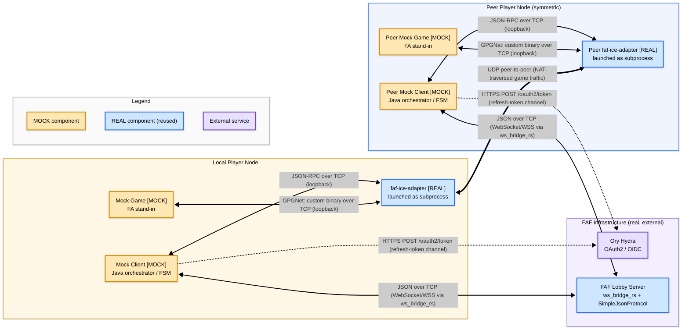

# Architecture & data flow

Component boundaries and transport protocols for a single Local Player Node
connected to one symmetric peer. The lobby server and OAuth provider are
shared infrastructure; the four components listed in WBS 2.2.4 — Mock Client,
FAF Lobby, ICE Adapter, Game Engine — are all represented explicitly and
labelled as mock or real.

The Local and Peer nodes are drawn as mirror images because every player's
machine runs the same three components and speaks the same four protocols.
If an edge appears on one side of the diagram, an identical edge must exist
on the other.

## Reading guide

- **Symmetric pair.** The Local and Peer subgraphs show the same three
  components connected the same way. Each Mock Client reads its credential
  from a file, and which file decides whether the Hydra edge exists at all.
  On the refresh-token channel the client exchanges that token at Hydra for
  a short-lived access token, rewriting the file with the rotated refresh
  token each time, which is the dotted edge drawn here; on the pre-signed
  access-token channel it sends the token as-is and never contacts Hydra.
  Either way the JWT reaches the lobby in the handshake's `auth` message,
  over a WebSocket the client has already opened. No client performs the
  OAuth2 authorization-code flow: that is a one-time human bootstrap in a
  browser
  ([`../operations/harness-runbook.md`](../operations/harness-runbook.md)
  §3), and it is how the first refresh token in that file got there.
  Neither client "routes through" Hydra on its way to the lobby; the lobby
  WebSocket is a separate long-lived connection.
- **Thin bidirectional arrows** are signalling / control-plane links. They
  carry JSON, JSON-RPC, or GPGNet control messages.
- **Dotted arrow**, in this diagram, means the edge is taken on one
  credential channel only. The Hydra edges are the refresh-token exchange,
  which a run authenticating from a pre-signed access token never makes.
- **Thick bidirectional arrow** (`IA <==> PIA`) carries the actual UDP
  game-simulation traffic. The lobby server deliberately never sees game
  traffic; it only relays ICE messages during negotiation.
- **Peer node is drawn symmetrically** so it's visually obvious that the
  same three local components exist on every player's machine. A real
  session has N ≥ 1 peer nodes; only one is shown for readability.
- **Edge ordering in the source** groups local-and-peer counterparts
  together (Hydra pair, lobby pair, local ICE/GPGNet pair, peer ICE/GPGNet
  pair, UDP tunnel). This makes it easy to spot label drift if anyone ever
  adds an edge to one side without mirroring it to the other.

## Protocol label sources

Every edge label on the four live channels follows the Communication
Channels table in
[`../research/project-briefing.md`](../research/project-briefing.md). The
dotted Hydra edges have no row there, because that table covers session
traffic only; they follow the Mock Client's steady-state token exchange in
[`sequence-full-session.md`](./sequence-full-session.md), drawn there as
`POST /oauth2/token (grant_type=refresh_token)`. The
`(WebSocket/WSS via ws_bridge_rs)` addendum on the lobby link is drawn from
[`../research/lobby-protocol-spec.md`](../research/lobby-protocol-spec.md)
§1, which documents the WebSocket bridge that translates between the mock
client and the lobby server's internal SimpleJsonProtocol. The
`(loopback)` qualifier on the JSON-RPC and GPGNet edges signals that those
links are local-TCP between a Mock Client / Mock Game and its own
`faf-ice-adapter` subprocess, never across the network.