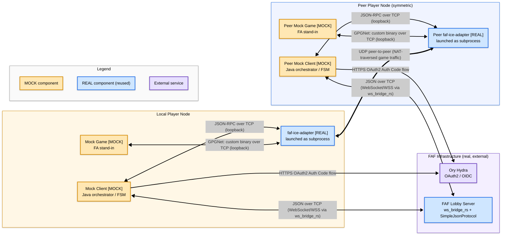

# Architecture & data flow

Component boundaries and transport protocols for a single Local Player Node
connected to one symmetric peer. The lobby server and OAuth provider are
shared infrastructure; the four components listed in WBS 2.2.4 — Mock Client,
FAF Lobby, ICE Adapter, Game Engine — are all represented explicitly and
labelled as mock or real.

The Local and Peer nodes are drawn as mirror images because every player's
machine runs the same three components and speaks the same four protocols.
If an edge appears on one side of the diagram, an identical edge must exist
on the other.

## Reading guide

- **Symmetric pair.** The Local and Peer subgraphs show the same three
  components connected the same way. Both Mock Clients perform the OAuth2
  Authorization Code flow against Hydra to obtain a JWT, then open a
  WebSocket to the lobby carrying that token. Neither client "routes
  through" Hydra on its way to the lobby — OAuth is a one-shot, out-of-band
  HTTPS call, and the lobby WebSocket is a separate long-lived connection.
- **Thin bidirectional arrows** are signalling / control-plane links. They
  carry JSON, JSON-RPC, or GPGNet control messages.
- **Thick bidirectional arrow** (`IA <==> PIA`) carries the actual UDP
  game-simulation traffic. The lobby server deliberately never sees game
  traffic — it only relays ICE candidates during negotiation.
- **Peer node is drawn symmetrically** so it's visually obvious that the
  same three local components exist on every player's machine. A real
  session has N ≥ 2 peer nodes; only one is shown for readability.
- **Edge ordering in the source** groups local-and-peer counterparts
  together (OAuth pair, lobby pair, local ICE/GPGNet pair, peer ICE/GPGNet
  pair, UDP tunnel). This makes it easy to spot label drift if anyone ever
  adds an edge to one side without mirroring it to the other.

## Protocol label sources

Every edge label is taken verbatim from the Communication Channels table in
[`../research/project-briefing.md`](../research/project-briefing.md). The
`(WebSocket/WSS via ws_bridge_rs)` addendum on the lobby link is drawn from
[`../research/lobby-protocol-spec.md`](../research/lobby-protocol-spec.md)
§1, which documents the WebSocket bridge that translates between the mock
client and the lobby server's internal SimpleJsonProtocol. The
`(loopback)` qualifier on the JSON-RPC and GPGNet edges signals that those
links are local-TCP between a Mock Client / Mock Game and its own
`faf-ice-adapter` subprocess, never across the network.