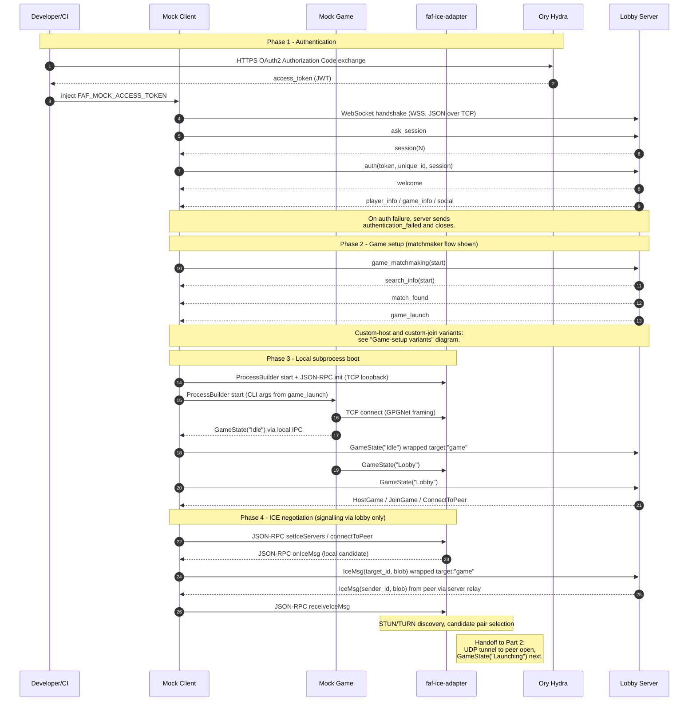
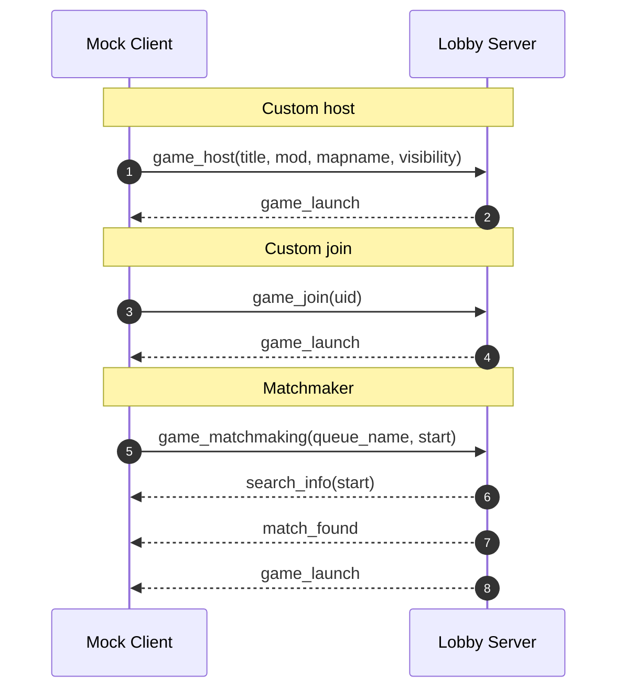
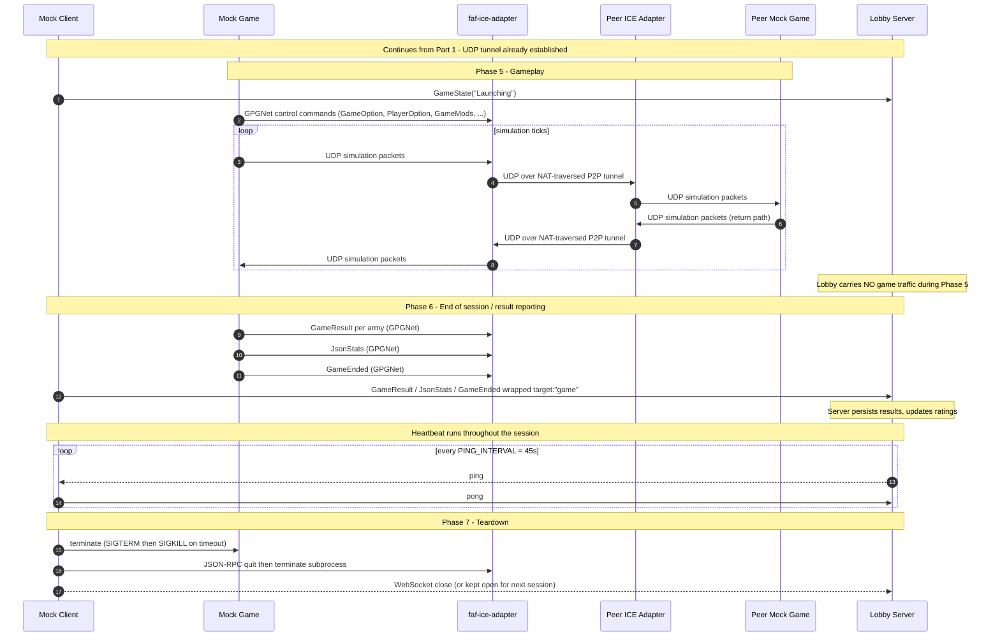

# Full-session inter-component message flow

The complete inter-component message flow from authentication through to
teardown is split into three diagrams for readability. 

1. **Part 1 — Signalling & setup.** OAuth, lobby authentication, the
   canonical (matchmaker) game-setup path, local subprocess boot, and ICE
   negotiation.
2. **Game-setup variants.** A small companion diagram listing the three
   alternative pre-`game_launch` exchanges a real session can take.
3. **Part 2 — Gameplay & teardown.** Live UDP game traffic, end-of-session
   result reporting, heartbeat, and session close.

Internal component state machines are out of scope (see WBS 2.2.5). The
arrows in these diagrams are protocol messages crossing component boundaries,
not state transitions.

---

## Part 1 — Signalling & setup

Timeline ends the moment the local and peer ICE adapters have established a
UDP tunnel and the Mock Client is about to send `GameState("Launching")`.
The matchmaker setup flow is shown as the canonical path; custom-host and
custom-join variants are covered in the companion diagram below.

---

## Game-setup variants

The same `game_launch` payload in Part 1 can be triggered by three different
exchanges. Only one of these three blocks occurs in any given session.

Field-level payload reference for each variant lives in
[`../research/lobby-protocol-spec.md`](../research/lobby-protocol-spec.md) §4.

---

## Part 2 — Gameplay & teardown

Timeline begins at `GameState("Launching")` with the ICE tunnel already open.
The heartbeat loop runs continuously throughout the session (not only after
Phase 5); it is drawn here because Part 2 covers the longer wall-clock span
where it is most visible.

---

## Reading guide

- **Participant-set changes between Part 1 and Part 2.** `Dev` and `Hydra`
  only matter for OAuth and are dropped from Part 2. The peer lane
  (`PIA`, `PMG`) only matters once the UDP tunnel is open, so it is dropped
  from Part 1. This is intentional and keeps each diagram narrow.
- **The `loop simulation ticks` block in Phase 5** is schematic. A real
  session exchanges thousands of UDP packets per second over the tunnel;
  the loop is drawn once for illustration.

## Source material

- OAuth, auth handshake, game setup, GPGNet wrapping, result reporting,
  heartbeat: [`../research/lobby-protocol-spec.md`](../research/lobby-protocol-spec.md)
  §§2–8.
- Component responsibilities and session narrative:
  [`../research/project-briefing.md`](../research/project-briefing.md)
  "How a Session Works" and "Communication Channels".
- Subprocess orchestration (ProcessBuilder, JSON-RPC init, teardown):
  [`../task-desc.md`](../task-desc.md) §1.1 Mock Client Core.