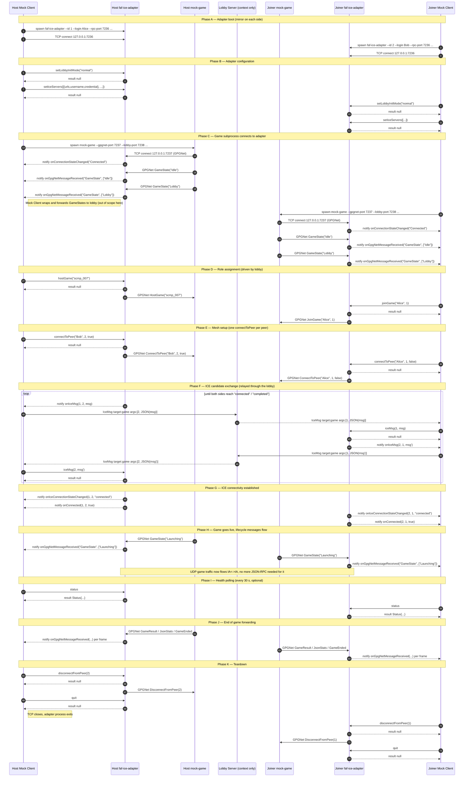

# ICE Adapter JSON-RPC Interface Spec

This document is the Mock Client's contract with `faf-ice-adapter` over its
local JSON-RPC TCP socket. It complements `lobby-protocol-spec.md`: the lobby
spec covers the WebSocket half of the orchestration, this spec covers the
local-IPC half.

The IPC channel is **JSON-RPC 2.0 over a single bidirectional TCP socket**.
The adapter binds and listens; the Mock Client connects.

> **Source of truth.** The method and notification tables below are
> consolidated from the upstream
> [java-ice-adapter README](https://github.com/FAForever/java-ice-adapter).
> Wire framing is documented from the
> [JJsonRpc](https://github.com/micheljung/JJsonRpc) library used by the real
> `downlords-faf-client`, since the README itself does not specify framing.

---

## 1. Transport

| Property | Value |
|---|---|
| Protocol | JSON-RPC 2.0 |
| Transport | Plain TCP (no TLS, loopback only) |
| Endpoint (default) | `127.0.0.1:7236` |
| Endpoint (configurable) | `--rpc-port <int>` on the adapter CLI |
| Server (listener) | `faf-ice-adapter` |
| Client (connector) | Mock Client |
| Encoding | UTF-8, no BOM |
| Bidirectionality | Both peers may send requests, responses, and notifications on the same socket |
| Lifetime | One TCP connection per ICE-adapter subprocess; no reconnect |

When the socket closes for any reason the adapter is considered dead. The
Mock Client surfaces the failure to the FSM and triggers session teardown
(see WBS 2.2.8 Subprocess Orchestration).

## 2. Wire framing

JSON-RPC 2.0 itself does not specify message framing — that is left to the
transport. The upstream adapter uses a naïve **brace-counting** framer
(see [`JJsonPeer.java`][jjsonrpc-peer]):

- Bytes are read one at a time.
- `{` increments a depth counter; `}` decrements it.
- When the depth returns to zero, the buffered bytes are parsed as one JSON
  message.
- No length prefix, no newline delimiter, no Content-Length header.
- Whitespace between messages is tolerated.

[jjsonrpc-peer]: https://github.com/micheljung/JJsonRpc/blob/master/src/main/java/com/nbarraille/jjsonrpc/JJsonPeer.java

**Outbound framing (Mock Client → adapter):** serialise the JSON object as
compact UTF-8 and append a single `\n`. The trailing newline is not strictly
required by the brace-counter, but is harmless and matches what the real
client emits via `PrintWriter.println(...)`.

**Inbound framing (adapter → Mock Client):** the Mock Client uses Jackson's
`ObjectMapper.readerFor(JsonNode.class).readValues(InputStream)` (a
`MappingIterator<JsonNode>`) over the socket input stream. This produces one
`JsonNode` per top-level value with no manual brace counting and is robust
against JSON strings that happen to contain `{` or `}`.

### 2.1 Compatibility quirk

The upstream brace counter does not track JSON string-literal state, so a
message containing `{` or `}` inside a string value would desync that
implementation. In practice the adapter never emits such payloads (object
fields are nested objects, not stringified JSON), so the bug is latent. The
Mock Client's Jackson-based reader is wire-compatible with the adapter's
output but is not affected by this bug.

## 3. Message shapes

All three JSON-RPC 2.0 message types may flow in either direction.

### 3.1 Request (Mock Client → adapter)

```json
{
  "jsonrpc": "2.0",
  "method": "joinGame",
  "params": ["Alice", 1],
  "id": 17
}
```

- `params` is always a positional array (named-parameter calls are not used
  by the adapter).
- `id` is a monotonically increasing positive `long`, starting at 1 for the
  first request on a connection. ID 0 is reserved/unused.

### 3.2 Response (adapter → Mock Client)

Success:

```json
{ "jsonrpc": "2.0", "result": {/* method-specific or null */}, "id": 17 }
```

Error:

```json
{
  "jsonrpc": "2.0",
  "error": { "code": -32601, "message": "Method Not Found" },
  "id": 17
}
```

### 3.3 Notification (either direction)

A request with no `id` field. The receiver MUST NOT send a response.

```json
{ "jsonrpc": "2.0", "method": "onIceMsg", "params": [1, 2, {/* msg */}] }
```

Notifications carry every adapter-originated event in this protocol
(`onIceMsg`, `onConnectionStateChanged`, `onGpgNetMessageReceived`, etc.).

### 3.4 Error codes

Standard JSON-RPC 2.0 codes. The Mock Client may return `-32601 Method Not
Found` if the adapter ever invokes a method on it (none are exposed). The
adapter uses `-32700`, `-32600`, `-32601`, `-32602`, and the server-error
range `-32000` to `-32099` (see `JJsonPeer.java`).

## 4. Methods (Mock Client → adapter)

Consolidated verbatim from the upstream README. Parameter order matches the
positional `params` array. "Returns" describes the JSON value in `result` of
a successful response; blank means `null`.

| Method | Params | Returns | Purpose |
|---|---|---|---|
| `quit` | — | — | Gracefully shut down `faf-ice-adapter`. |
| `hostGame` | `mapName: string` | — | Tell the game to create the lobby and host on Lobby state. |
| `joinGame` | `remotePlayerLogin: string`, `remotePlayerId: int` | — | Tell the game to create the lobby, create a PeerRelay in answer mode, and join the remote game. |
| `connectToPeer` | `remotePlayerLogin: string`, `remotePlayerId: int`, `offer: bool` | — | Create a PeerRelay and tell the game to connect to the remote peer in offer or answer mode. |
| `disconnectFromPeer` | `remotePlayerId: int` | — | Destroy the PeerRelay and tell the game to disconnect from the remote peer. |
| `setLobbyInitMode` | `lobbyInitMode: "normal" \| "auto"` | — | Set the lobby init mode. `"normal"` for custom lobbies, `"auto"` for matchmaker / ladder. |
| `iceMsg` | `remotePlayerId: int`, `msg: object` | — | Hand a remote ICE candidate / SDP message to the local PeerRelay. |
| `sendToGpgNet` | `header: string`, `chunks: array` | — | Send an arbitrary GPGNet frame to the game (escape hatch for messages without a dedicated method). |
| `setIceServers` | `iceServers: array<RTCIceServer>` | — | Configure STUN/TURN servers. **MUST be called before `joinGame` / `connectToPeer`.** |
| `status` | — | `Status` (see §6) | Poll the adapter's runtime state. Used as health-check signal by WBS 2.2.8. |

### 4.1 `RTCIceServer` shape

Same as the WebRTC IDL — `{ "urls": [string], "username"?: string, "credential"?: string }`. The adapter forwards the array to its WebRTC engine unchanged.

## 5. Notifications (adapter → Mock Client)

| Notification | Params | Purpose |
|---|---|---|
| `onConnectionStateChanged` | `state: "Connected" \| "Disconnected"` | The game has connected (or disconnected) to the adapter's internal GPGNet TCP server. |
| `onGpgNetMessageReceived` | `header: string`, `chunks: array` | The game emitted a GPGNet frame; the adapter forwards it verbatim. |
| `onIceMsg` | `localPlayerId: int`, `remotePlayerId: int`, `msg: object` | A local PeerRelay produced an ICE candidate / SDP for `remotePlayerId`. The Mock Client must forward this to the lobby (see §7). |
| `onIceConnectionStateChanged` | `localPlayerId: int`, `remotePlayerId: int`, `state: string` | Mirrors `RTCPeerConnection.iceConnectionState` (`new` / `checking` / `connected` / `completed` / `failed` / `disconnected` / `closed`). |
| `onConnected` | `localPlayerId: int`, `remotePlayerId: int`, `connected: bool` | High-level summary: the peer is reachable / unreachable. |

> **Undocumented notification.** The README's "Example usage sequence"
> mentions `onDatachannelOpen` as an alternative readiness indicator, but
> the notification table does not list it. The Mock Client treats it as
> informational; the contract for "peer ready" is
> `onIceConnectionStateChanged → "connected" | "completed"`.

> **Forward compatibility.** Any notification whose `method` is not in the
> table above is logged at WARN with the full payload and discarded. The
> Mock Client must not crash on unknown notifications.

## 6. `status` structure

Returned by the `status` method. Shape from the README:

```text
{
  "version":          string  // adapter version
  "ice_servers_size": int     // count of ICE servers configured via setIceServers
  "lobby_port":       int     // actual UDP port the game lobby uses; matches --lobby-port if non-zero
  "init_mode":        string  // current value set via setLobbyInitMode
  "options":          object  // CLI options the adapter was launched with
  "gpgnet": {
    "local_port":  int      // port the game must connect to (`/gpgnet 127.0.0.1:<local_port>`)
    "connected":   bool     // is the game currently connected to the GPGNet TCP server?
    "game_state":  string   // last GameState received from the game
    "task_string": string   // task description (joining/hosting/...)
  },
  "relays": [               // one entry per peer
    {
      "remote_player_id":    int,
      "remote_player_login": string,
      "local_game_udp_port": int,
      "ice": {
        "offerer":          bool,
        "state":            string,  // RTCPeerConnection.iceConnectionState
        "gathering_state":  string,  // RTCPeerConnection.iceGatheringState
        "datachannel_state":string,  // RTCDataChannel.readyState
        "connected":        bool,
        "loc_cand_addr":    string,
        "rem_cand_addr":    string,
        "loc_cand_type":    "local" | "stun" | "relay",
        "rem_cand_type":    "local" | "stun" | "relay",
        "time_to_connected":double   // seconds
      }
    }
    // ...
  ]
}
```

> **Wire reality (verified 3.3.14).** The actual `status` response differs from the logical shape
> above in two ways a parser must handle: (1) the JSON-RPC `result` is a **double-encoded JSON
> string**, not a nested object — it must be parsed again; and (2) the gpgnet block is spelled
> **`gpgpnet`** (an upstream typo), not `gpgnet`. Example:
> `{"result":"{\"version\":\"SNAPSHOT\",…,\"gpgpnet\":{…},\"relays\":[]}","id":1,"jsonrpc":"2.0"}`.
> The R35 status DTO and the §6.2 health poller (subprocess-orchestration-spec) must account for both.

## 7. ICE candidate relay loop (end-to-end)

The ICE candidate relay spans **two protocols**: JSON-RPC locally, lobby
WebSocket remotely. The Mock Client is the only component that touches both.

```text
Local node                                              Remote node
───────────                                             ─────────────
faf-ice-adapter                                         faf-ice-adapter
       │  (1) onIceMsg(local=L, remote=R, msg)                 ▲
       ▼                                                       │ (5) iceMsg(remote=L, msg)
Mock Client (ours)                                      Mock Client (peer)
       │  (2) wrap as {                                        ▲
       │     command:"IceMsg",                                 │ (4) unwrap, parse args[1] as JSON
       │     target:"game",                                    │
       │     args:[R, JSON.stringify(msg)] }                   │
       ▼                                                       │
Lobby WebSocket  ───────── (3) Lobby Server relays ─────────►  Lobby WebSocket
```

Steps:

1. **Adapter → Mock Client (JSON-RPC notification).** The local PeerRelay
   gathers a candidate. Adapter sends `onIceMsg(localPlayerId, remotePlayerId, msg)`.
   `msg` is a JSON object (NOT a string).
2. **Mock Client → Lobby (WebSocket envelope).** The Mock Client serialises
   `msg` to a JSON string and sends to the lobby:

   ```json
   { "command": "IceMsg", "target": "game",
     "args": [remotePlayerId, "<JSON-stringified msg>"] }
   ```

   `args[0]` is the **receiver** id from this side's perspective.
3. **Lobby Server relay.** The server forwards the wrapped payload to the
   peer's WebSocket, swapping `args[0]` to the **sender** id (i.e. our id).
4. **Lobby → Peer Mock Client.** The peer receives
   `{ command:"IceMsg", target:"game", args:[<senderId>, "<msg-string>"] }`.
   It parses `args[1]` back to a JSON object.
5. **Peer Mock Client → Peer adapter.** The peer calls
   `iceMsg(remotePlayerId=<senderId>, msg=<parsed object>)` on its local
   adapter, which feeds the candidate to its PeerRelay.

In summary: `onIceMsg` from JSON-RPC is wrapped onto the lobby; `IceMsg`
from the lobby is unwrapped and pushed to JSON-RPC. The two ends of the
loop are symmetric except for the `args[0]` semantics swap, which the
lobby server performs.

## 8. Adapter command-line arguments

Verbatim from the README; arguments relevant to the Mock Client are bold.

| Flag | Default | Notes |
|---|---|---|
| **`--id <int>`** | required | Local player id. Sourced from `welcome.me.id` cached at lobby auth time, OR `game_launch.uid` if we want per-game ids — see §8.1. |
| **`--login <string>`** | required | Local player login. Sourced from `welcome.me.login`. |
| **`--game-id <int>`** | required | Game id. **Required by 3.3.x — the adapter prints usage and exits without it.** Sourced from `game_launch.uid`; a placeholder for the standalone diagnostics. |
| **`--rpc-port <int>`** | `7236` | TCP port for the JSON-RPC server. The Mock Client allocates a free port and passes it explicitly so multiple harness instances do not collide. |
| **`--gpgnet-port <int>`** | `0` (auto) | TCP port for the internal GPGNet server that mock-game connects to. **Pass an explicit port.** Mock-game receives the same port via its CLI. |
| **`--lobby-port <int>`** | `0` (auto) | UDP port the game lobby will use for game-traffic packets to/from the PeerRelay. **Pass an explicit port.** Mock-game receives the same port via its CLI. |
| `--log-directory <path>` | env `LOG_DIR` | Deprecated; use the `LOG_DIR` env var instead. |
| `--force-relay` | off | Forces TURN-only candidates; useful for fault-injection later (WBS 3.x). |
| `--debug-window` | off | Requires JavaFX; never set in headless Docker. |
| `--info-window` | off | Same. |
| `--delay-ui <ms>` | 0 | Same. |
| `--telemetry-server <url>` | FAF telemetry | On launch the adapter opens a websocket to `ice-telemetry.faforever.com`. **No clean disable in 3.3.14** — an empty value just errors (`unknown scheme: null`); telemetry failure is non-blocking. |
| `--help` | — | Print usage and exit. |

> **Headless runtime caveat (verified 3.3.14).** Even the `-nojfx` jar's bundled `logback.xml`
> wires in a JavaFX log appender, so on a JavaFX-less JRE it crashes on its first log line unless
> launched with `-Dlogback.configurationFile=<console-only config>`. `IceAdapterLauncher` does
> this automatically; see `documentation/operations/ice-adapter-setup.md`.

### 8.1 Identity sourcing

`--id` and `--login` must match the **lobby identity**, otherwise the lobby
server rejects relayed `IceMsg` payloads (the server uses the embedded ids
to validate sender/receiver). The Mock Client sources both from the
`welcome` payload (`me.id`, `me.login`) cached during lobby auth, not from
`game_launch`.

## 9. Lifecycle ordering

The expected JSON-RPC call ordering for a single session, from adapter
launch through teardown. This is the canonical sequence the FSM (WBS 2.2.5)
must implement.

| Phase | Step | Direction | Message | Notes |
|---|---|---|---|---|
| Boot | 1 | (CLI) | `faf-ice-adapter --id … --login … --rpc-port P …` | Subprocess launch. See WBS 2.2.8. |
| Boot | 2 | MC → IA | TCP connect to `127.0.0.1:P` | Mock Client is the TCP client. |
| Setup | 3 | MC → IA | `setLobbyInitMode("normal" \| "auto")` | "auto" iff matchmaker game. |
| Setup | 4 | MC → IA | `setIceServers([…])` | Required before `joinGame` / `connectToPeer`. STUN/TURN config from lobby (or static dev config). |
| Setup | 5 | (CLI) | launch `mock-game` with `--gpgnet-port`, `--lobby-port` matching adapter | Subprocess launch. See WBS 2.2.8. |
| Setup | 6 | IA → MC | `onConnectionStateChanged("Connected")` | Mock-game has connected to the adapter's GPGNet TCP server. |
| Setup | 7 | IA → MC | `onGpgNetMessageReceived("GameState", ["Idle"])` | Mock-game emitted its first frame. Mock Client wraps and forwards to lobby. |
| Setup | 8 | IA → MC | `onGpgNetMessageReceived("GameState", ["Lobby"])` | Same. |
| Role | 9a | MC → IA | `hostGame(mapName)` | Host role only. Triggered by HostGame from lobby. Adapter side-effect: emits GPGNet HostGame(map) to mock-game.|
| Role | 9b | MC → IA | `joinGame(hostLogin, hostId)` | Joiner role only. Triggered by JoinGame from lobby. Adapter side-effects: creates an answer-mode PeerRelay and emits GPGNet JoinGame(login, id) to mock-game. |
| Role | 10 | MC → IA | `connectToPeer(login, id, offer)` | Once per peer, with offer=true for the host's call to a joiner, false for the joiner's call to the host. Adapter side-effects: spins up a PeerRelay and emits GPGNet ConnectToPeer(name, id, offer) to mock-game. |
| ICE | 11 | IA → MC | `onIceMsg(local, remote, msg)` | Repeated. Forward to lobby per §7. |
| ICE | 12 | MC → IA | `iceMsg(remote, msg)` | Repeated. Triggered by `IceMsg` arriving from the lobby. |
| ICE | 13 | IA → MC | `onIceConnectionStateChanged(local, remote, "connected" \| "completed")` | Per peer. Treat "connected" or "completed" as ready. |
| ICE | 14 | IA → MC | `onConnected(local, remote, true)` | High-level confirmation. |
| Live | 15 | IA → MC | `onGpgNetMessageReceived("GameState", ["Launching"])` | Mock-game has gone live. Mock Client wraps and forwards to lobby. |
| Live | 16 | IA → MC | additional `onGpgNetMessageReceived(…)` | `GameOption`, `PlayerOption`, `GameMods`, `GameResult`, `JsonStats`, `GameEnded`. Forwarded verbatim. |
| Health | * | MC → IA | `status` | Polled every 30 s with 2 s timeout (WBS 2.2.8). |
| Teardown | 17 | MC → IA | `disconnectFromPeer(id)` | One per peer; optional but tidy. Adapter side-effects: tears down the PeerRelay and emits GPGNet DisconnectFromPeer(id) to mock-game. |
| Teardown | 18 | MC → IA | `quit` | Graceful shutdown. |
| Teardown | 19 | (proc) | wait for adapter exit ≤ 5 s, else `SIGTERM`/`SIGKILL` | See WBS 2.2.8. |

## 10. Sources

- [java-ice-adapter README](https://github.com/FAForever/java-ice-adapter) — methods, notifications, status structure, CLI, example sequence.
- [JSON-RPC 2.0 Specification](https://www.jsonrpc.org/specification) — message shapes, error codes, notification semantics.
- [JJsonRpc — `JJsonPeer.java`](https://github.com/micheljung/JJsonRpc/blob/master/src/main/java/com/nbarraille/jjsonrpc/JJsonPeer.java) — wire framing implementation used by the real `downlords-faf-client`.
- [`downlords-faf-client/build.gradle`](https://github.com/FAForever/downlords-faf-client/blob/develop/build.gradle) — dependency confirmation (`com.github.micheljung:JJsonRpc:01a7fba5f4`).
- `documentation/research/lobby-protocol-spec.md` §6 — GPGNet-over-WebSocket wrapping.
- `documentation/research/project-briefing.md` "Communication Channels" — channel taxonomy.

## 11. Sequence diagram — JSON-RPC traffic for a two-player custom session

The diagram below traces every JSON-RPC message between a Mock Client and
its `faf-ice-adapter` for one two-player custom-game session, from adapter
launch to clean shutdown. It pairs a host (Alice, id 1) and a joiner (Bob,
id 2) on opposite sides of the page so the symmetry between the two roles
is visible at a glance.

