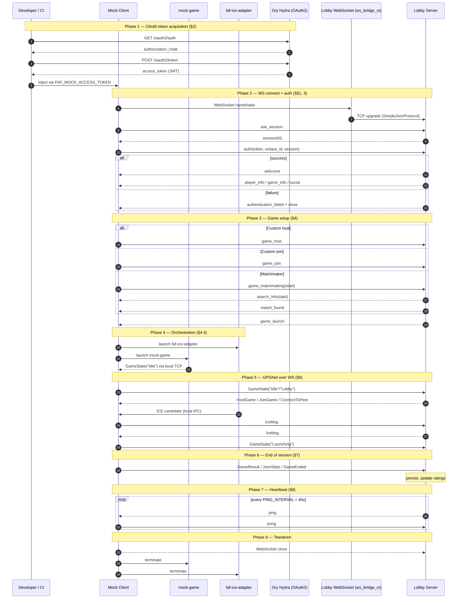

<a id="section-1-transport"></a>
## 1. WebSocket Transport Layer

### Protocol
The FAF Lobby Server uses a **WebSocket-based bidirectional messaging protocol**. All messages are JSON objects separated by newlines, with a `command` field identifying the message type.

### Server Endpoints
| Environment | URL | Protocol |
|---|---|---|
| Production | `wss://ws.faforever.com/ws` | WSS (TLS) |
| Test | `wss://ws.faforever.xyz/ws` | WSS (TLS) |
| Local | `ws://localhost/ws` | WS |

### Wire Format
Each message is a single JSON object terminated by a newline character (`\n`). There is no additional framing beyond WebSocket frames themselves.

> **Implementation note:** FAF's internal server protocol is newline-terminated JSON, and the Rust ws_bridge_rs service translates between WebSocket and that TCP protocol. Over WebSocket, framing is handled natively, each send/receive is a discrete frame, so clients using java.net.http.WebSocket can rely on onText(CharSequence data, boolean last) to deliver complete messages without raw newline-delimitation logic. A trailing \n may still appear as a pass-through artifact from the bridge; incoming messages should be parsed using WebSocket frame boundaries rather than that delimiter. Appending \n on outgoing messages is a conservative compatibility choice, but whether the bridge actually requires it should be verified against its source rather than assumed.

```json
{"command": "ping"}\n
```

Every message contains a `command` field that identifies the message type. Direction is implicit: some commands are only sent by the client, some only by the server, and some (like `ping`/`pong`) are sent by both.

### Architecture Note
The WebSocket endpoint is not served directly by the lobby server. The lobby server uses a raw TCP protocol internally ([SimpleJsonProtocol](https://faforever.github.io/server/protocol/simple_json.html)). A separate bridge service, [ws_bridge_rs](https://github.com/FAForever/ws_bridge_rs), translates between WebSocket and the server's internal TCP protocol.

The Mock Client connects via **WebSocket only** and does not need to implement the raw TCP protocol. This ensures the test harness accurately mimics real production 
client behaviour and validates the bridge layer alongside the server.

### Connection Lifecycle
1. Client opens a WebSocket connection to one of the server endpoints
2. Connection is upgraded via standard WebSocket handshake
3. Once connected, client and server exchange newline-delimited JSON messages
4. Connection is maintained via periodic ping/pong heartbeats (see [§8](#section-8-heartbeat))
5. Connection terminates when either side closes the WebSocket or the session times out

### Sources
- [FAForever Lobby Server AsyncAPI Spec](https://faforever.github.io/faf-api-specs)
- [SimpleJsonProtocol (internal server protocol)](https://faforever.github.io/server/protocol/simple_json.html)
- [ws_bridge_rs (WebSocket bridge)](https://github.com/FAForever/ws_bridge_rs)

<a id="section-2-oauth"></a>
## 2. OAuth Token Acquisition

### Overview
Before connecting to the lobby WebSocket, the client must obtain a **JWT access token** via OAuth2. FAF uses [Ory Hydra](https://www.ory.sh/hydra/) as its OAuth2/OIDC provider, with the [faf-user-service](https://github.com/FAForever/faf-user-service) acting as the login backend.

### Production Endpoints

| Endpoint | URL |
|---|---|
| OAuth2 Base (Hydra) | `https://hydra.faforever.com` |
| Authorization | `https://hydra.faforever.com/oauth2/auth` |
| Token | `https://hydra.faforever.com/oauth2/token` |

### Local Development Endpoints

| Endpoint | URL |
|---|---|
| OAuth2 Base (Hydra) | `http://localhost:4444` |
| Authorization | `http://localhost:4444/oauth2/auth` |
| Token | `http://localhost:4444/oauth2/token` |

Local setup uses `docker compose up -d` from the [faf-user-service](https://github.com/FAForever/faf-user-service) repo, which automatically creates an OAuth client with client ID `faf-client` and redirect URL `http://127.0.0.1`.

### Client Configuration (Production)

From the [downlords-faf-client](https://github.com/FAForever/downlords-faf-client) production config:

| Parameter | Value |
|---|---|
| Client ID | `2e8808cf-5889-469b-b2c3-01f0cc58c4af` |
| Scopes | `openid offline public_profile upload_map upload_mod lobby` |
| Redirect URI | `http://127.0.0.1` (localhost callback) |

> **Note:** As of the Hydra 2.x migration, client IDs are UUIDs by default rather than 
> human-readable strings like `faf-client`.

### Authorization Code Flow

The production FAF client uses the standard **OAuth2 Authorization Code** grant:

```
1. Client opens browser/webview to Hydra authorization endpoint:
   GET https://hydra.faforever.com/oauth2/auth
     ?client_id=2e8808cf-5889-469b-b2c3-01f0cc58c4af
     &response_type=code
     &redirect_uri=http://127.0.0.1
     &scope=openid offline public_profile lobby
     &state=<random-string>

2. User authenticates via faf-user-service login page

3. Hydra redirects browser to:
   http://127.0.0.1?code=<authorization_code>&state=<random-string>

4. Client exchanges the authorization code for tokens:
   POST https://hydra.faforever.com/oauth2/token
   Content-Type: application/x-www-form-urlencoded

   grant_type=authorization_code
   &code=<authorization_code>
   &client_id=2e8808cf-5889-469b-b2c3-01f0cc58c4af
   &redirect_uri=http://127.0.0.1

5. Hydra responds with:
   {
     "access_token": "eyJhbGciOiJSUzI1NiJ9...",
     "token_type": "bearer",
     "expires_in": 43200,
     "refresh_token": "...",
     "id_token": "...",
     "scope": "openid offline public_profile lobby"
   }

6. The access_token (JWT) is used as the `token` field in the
   WebSocket `auth` message (see [§3](#section-3-auth)).
```

### Mock Client Considerations

The Authorization Code flow requires a browser interaction, which is unsuitable for a headless 
CLI mock. Possible approaches for the mock client:

1. **Local dev with test credentials**: Run the faf-user-service Docker stack locally, which 
   pre-seeds test users. Automate the browser flow programmatically (HTTP requests to the 
   authorization and login endpoints, following redirects) to obtain a token without manual 
   interaction. (Avoid if possible)

2. **Pre-obtained token**: Obtain a token once manually and pass it to the mock client via 
   environment variable or config file. Tokens expire (default ~12 hours / 43200 seconds), 
   so this is only viable for short test sessions. (May be the best way to unblock developement initally)

3. **Ask FAF developers**: The FAF team may be able to provide a test client configured with 
   the `client_credentials` grant type, which allows direct token acquisition without browser 
   interaction. The faf-stack configuration shows M2M client credentials are used for other 
   services (e.g., `faf-website-public`). Contact the team at 
   [FAF Zulip](https://faforever.zulipchat.com/). (Preferred, allows CI pipeline to run indefinitely)

### Scope Relevance

The `lobby` scope is the critical one for WebSocket access. The mock client's minimum required 
scopes are:

| Scope | Purpose |
|---|---|
| `lobby` | Required for WebSocket lobby server access |
| `openid` | Standard OIDC, provides identity claims in the JWT |

Other scopes (`upload_map`, `upload_mod`, `public_profile`, `offline`) are not required for 
the mock client's core functionality.

### Key Takeaway
The mock client ultimately needs a valid OAuth2 **access token** (JWT bearer token) issued by FAF's Hydra instance. This token is obtained before the WebSocket login sequence and is sent in the `token` field of the lobby `auth` message.

### Credential Handling

The mock client must never hardcode or commit OAuth credentials. Tokens, client IDs, and client secrets must be supplied strictly via environment variables, for example:

| Variable | Purpose |
|---|---|
| `FAF_MOCK_CLIENT_ID` | OAuth client ID (public — may be tracked in `.env`) |
| `FAF_MOCK_CLIENT_SECRET` | OAuth client secret (secret — must be gitignored) |
| `FAF_MOCK_ACCESS_TOKEN` | Pre-obtained JWT for short test sessions (secret — must be gitignored) |

Non-secret values (hosts, ports, public client IDs, redirect URIs) may live in the tracked `.env` file. Secret values (client secrets, live tokens) must live in an untracked file such as `.env.local`, or be injected via CI secrets / the developer's shell. A `.env.example` file lists every variable so new contributors know what to set without exposing any real credentials.

### Sources
- [downlords-faf-client production config](https://github.com/FAForever/downlords-faf-client/blob/develop/src/main/resources/application-prod.yml)
- [faf-user-service](https://github.com/FAForever/faf-user-service) — local OAuth setup
- [Hydra OAuth PR #2175](https://github.com/FAForever/downlords-faf-client/pull/2175) — original Hydra integration
- [Hydra 2.x migration PR #3403](https://github.com/FAForever/downlords-faf-client/pull/3403) — UUID client IDs
- [faf-stack .env](https://github.com/FAForever/website/blob/develop/.env.faf-stack) — M2M client config reference

<a id="section-3-auth"></a>
## 3. Authentication Sequence Over WebSocket

Once a WebSocket connection is established and the client holds a valid OAuth JWT (see [§2](#section-2-oauth)), authentication proceeds as a four-step handshake.

### Sequence

| # | Direction | Command | Purpose |
|---|---|---|---|
| 1 | Client → Server | `ask_session` | Request a session ID |
| 2 | Server → Client | `session` | Assign session ID |
| 3 | Client → Server | `auth` | Authenticate with JWT |
| 4 | Server → Client | `welcome` or `authentication_failed` | Success or failure |

After a successful welcome, the client should be prepared to receive additional state-sync messages such as player_info, game_info, and social. The server also supports matchmaker_info, which is sent in response to requests and periodic updates.

### Payloads

**1. Client requests a session**
```json
{
  "command": "ask_session",
  "version": "0.11.16",
  "user_agent": "faf-client"
}
```

**2. Server assigns session ID**
```json
{
  "command": "session",
  "session": 812469452
}
```

**3. Client authenticates**
```json
{
  "command": "auth",
  "token": "eyJhbGciOiJSUzI1NiJ9...",
  "unique_id": "7d04beb8-d4b8-40f5-8464-a9efa8546728",
  "session": 812469452
}
```

| Field | Description |
|---|---|
| `token` | OAuth JWT obtained from Hydra (see [§2](#section-2-oauth)) |
| `unique_id` | Hardware identifier hash (used for ban enforcement) |
| `session` | Session ID received in step 2 |

**4a. Success — server sends `welcome`**
```json
{
  "command": "welcome",
  "me": {
    "id": 3,
    "login": "Rhiza",
    "clan": "123",
    "country": "",
    "ratings": {
      "global":    { "rating": [1650, 62.52], "number_of_games": 2 },
      "ladder_1v1":{ "rating": [1650, 62.52], "number_of_games": 2 }
    }
  },
  "current_time": "1970-01-01T00:00:00+00:00",
  "id": 3,
  "login": "Rhiza"
}
```

**4b. Failure — server sends `authentication_failed`**
```json
{
  "command": "authentication_failed",
  "text": "Login not found or password incorrect. They are case sensitive."
}
```

### `unique_id` Handling

The `auth` payload requires a `unique_id`, which the AsyncAPI describes as a hardware
identifier hash. FAF's broader UID infrastructure appears to use this value for account
linkage and enforcement, but the upstream protocol documentation does not define a special
mock-client format or any documented test-environment bypass identifier.

For the Mock Client, this is an implementation decision that should be made explicitly: either generate a stable synthetic identifier for a given developer/test environment, or allow the identifier to be supplied via configuration (for example, an environment variable
such as `FAF_MOCK_UNIQUE_ID`). A random per-session UUID may be acceptable for isolated testing, but it may reduce reproducibility if the test environment expects a stable identity.

### Timing Constraint
The server enforces a login timeout of **5 minutes** (`LOGIN_TIMEOUT = 300` seconds in 
[server/config.py](https://github.com/FAForever/server/blob/develop/server/config.py)). 
A connection that does not successfully authenticate within this window is dropped.

### Post-Welcome State Sync
Immediately after `welcome`, the server pushes the current world state:

- `player_info` — list of all online players with ratings
- `game_info` — list of all visible open games
- `social` — friends list, foes list, and IRC auto-join channels
- `matchmaker_info` — current matchmaker queue state

The mock client should be ready to consume these messages as soon as `welcome` is received. Ensure the Mock Client's WebSocket listener is fully initialized and ready to buffer incoming JSON frames before sending the auth command, or you risk dropping the initial world state.

### Sources
- AsyncAPI: [https://faforever.github.io/faf-api-specs](https://faforever.github.io/faf-api-specs)
- Lobby state machine: [https://github.com/FAForever/faf-api-specs/blob/main/lobby-to-client/state-machine.md](https://github.com/FAForever/faf-api-specs/blob/main/lobby-to-client/state-machine.md)

<a id="section-4-game-setup"></a>
## 4. Game Session Setup Flows

FAF supports two distinct game setup flows. Both end with the server sending a `game_launch` 
message, but the triggers and prior message exchanges differ.

### 4.1 Custom Game Flow (Host)

```
Host Client                      Server
    │                              │
    │─── game_host ───────────────▶│   title, visibility, mod, mapname
    │                              │
    │◀──────────── game_launch ────│   uid, mod, game_type=custom
    │                              │
    │ (host launches game process) │
    │                              │
    │─── GameState("Idle") ───────▶│   (wrapped: target="game")
    │─── GameState("Lobby") ──────▶│
    │                              │
    │◀──────── HostGame(map) ──────│   (wrapped: target="game")
    │                              │
    │  ... host configures lobby, joiners connect ...
    │                              │
    │─── GameState("Launching") ──▶│   game goes LIVE
```

**Host's `game_host` request:**
```json
{
  "command": "game_host",
  "title": "Test game",
  "visibility": "public",
  "mod": "faf",
  "mapname": "scmp_007",
  "password": null
}
```

### 4.2 Custom Game Flow (Joiner)

```
Joiner Client                    Server
    │                              │
    │─── game_join ───────────────▶│   uid (game ID)
    │                              │
    │◀──────────── game_launch ────│   uid, mod, game_type=custom
    │                              │
    │─── GameState("Idle") ───────▶│
    │─── GameState("Lobby") ──────▶│
    │                              │
    │◀──── JoinGame(host, id) ─────│   (wrapped: target="game")
    │◀──── ConnectToPeer(...) ─────│   (for each peer)
    │                              │
    │  ... ICE negotiation via IceMsg ...
    │                              │
    │◀──── (host launches game) ───│
```

**Joiner's `game_join` request:**
```json
{
  "command": "game_join",
  "uid": 42,
  "password": null
}
```

### 4.3 Matchmaking Flow

```
Client                           Server
    │                              │
    │─── game_matchmaking ────────▶│   queue_name, state="start"
    │                              │
    │◀──── search_info ────────────│   queue_name, state="start"
    │                              │
    │     ... wait in queue ...    │
    │                              │
    │◀──── match_found ────────────│   queue_name
    │◀──── game_launch ────────────│   game_type=matchmaker, team, faction,
    │                              │   map_position, expected_players
    │                              │
    │  (matchmaker games have init_mode=1 / AUTO_LOBBY)
    │  (game skips manual host config, server pre-sets options)
    │                              │
    │─── GameState("Idle") ───────▶│   (same GPGNet flow from here)
```

**Client's matchmaking request:**
```json
{
  "command": "game_matchmaking",
  "queue_name": "ladder1v1",
  "state": "start"
}
```

**Server's match-found notification:**
```json
{
  "command": "match_found",
  "queue_name": "ladder1v1"
}
```
<a id="section-4-4-orchestration-note"></a>

### 4.4 Orchestration Note (Mock Client implementation, not protocol)

The sequence diagrams above show `game_launch` followed by `GameState("Idle")` as if they
are adjacent protocol events. They are not automatic — `GameState("Idle")` is emitted by
the launched game process, not by the client itself. In the Mock Client this means:

1. The WebSocket listener receives `game_launch` and dispatches it as an event to the
   central FSM controller. Lobby-state progression pauses at this point.
2. The FSM executes the subprocess boot sequence:
   - launch `faf-ice-adapter` via `ProcessBuilder`
   - launch `mock-game` via `ProcessBuilder`, passing the parsed `game_launch` arguments
   - await the local TCP IPC connection from `mock-game`
3. Once `mock-game` connects and emits its first GPGNet `GameState` message over local TCP,
   the FSM instructs the proxy layer to wrap it as `{"command": "GameState", "target":
   "game", "args": ["Idle"]}` and forward it to the Lobby Server.

The Mock Client is therefore a **proxy** for GPGNet traffic, not its originator. The
architecture flow is: **Protocol → Event → FSM → Subprocess → Proxy.** This note applies
identically to the custom-host, custom-joiner, and matchmaker flows above.

### Key Differences

| Aspect | Custom | Matchmaker |
|---|---|---|
| Trigger | Host: `game_host`, Joiner: `game_join` | `game_matchmaking(start)` + `match_found` |
| `init_mode` | 0 (NORMAL_LOBBY) | 1 (AUTO_LOBBY) |
| Lobby config | Host configures manually | Server pre-sets team, faction, slot |
| Setup timeout | 30 seconds | 60 seconds |
| `game_launch` extras | Minimal | Includes `team`, `faction`, `map_position`, `expected_players`, `mapname`, `map_pool_map_version_id` |

### Sources
AsyncAPI: https://faforever.github.io/faf-api-specs
Lobby state machine: https://github.com/FAForever/faf-api-specs/blob/main/lobby-to-client/state-machine.md
Game state machine: https://github.com/FAForever/faf-api-specs/blob/main/lobby-to-client/game-state-machine.md

---

<a id="section-5-game-launch"></a>
## 5. `game_launch` Payload

The `game_launch` message is the critical trigger that tells the client to launch the game 
process. It is sent by the server at the end of both custom and matchmaker setup flows.

### Custom Game Launch
```json
{
  "command": "game_launch",
  "args": ["/numgames", 5],
  "uid": 42,
  "mod": "faf",
  "name": "Test Game Name",
  "init_mode": 0,
  "game_type": "custom",
  "rating_type": "global"
}
```

### Matchmaker Game Launch
```json
{
  "command": "game_launch",
  "args": ["/numgames", 0],
  "uid": 41956,
  "mod": "ladder1v1",
  "name": "ladder1 Vs ladder2",
  "init_mode": 1,
  "game_type": "matchmaker",
  "rating_type": "ladder_1v1",
  "team": 2,
  "faction": 1,
  "expected_players": 2,
  "map_position": 1,
  "mapname": "scmp_015",
  "map_pool_map_version_id": 1
}
```

### Field Reference

| Field | Type | Required | Description |
|---|---|---|---|
| `command` | string | yes | Always `"game_launch"` |
| `uid` | integer | yes | Game ID |
| `mod` | string | yes | Featured mod (e.g., `"faf"`, `"coop"`, `"ladder1v1"`) |
| `name` | string | yes | Game display name |
| `init_mode` | integer | yes | 0 = normal lobby, 1 = auto lobby (deprecated — infer from `game_type`) |
| `game_type` | string | yes | `"coop"`, `"custom"`, or `"matchmaker"` |
| `rating_type` | string | yes | e.g., `"global"`, `"ladder_1v1"` |
| `args` | array | no | Additional launch arguments passed to the game executable |
| `mapname` | string | matchmaker only | Map folder name |
| `team` | integer | matchmaker only | Team assignment |
| `faction` | integer | matchmaker only | 1=UEF, 2=Aeon, 3=Cybran, 4=Seraphim |
| `map_position` | integer | matchmaker only | Start spot on the map |
| `expected_players` | integer | matchmaker only | Expected player count |
| `game_options` | object | matchmaker only | Additional game options |
| `map_pool_map_version_id` | integer | matchmaker only | Map pool version reference |

### Mock Client Behaviour

`game_launch` is not answered with a direct protocol response. Receipt of the message
triggers the local orchestration sequence defined in **4.4 Orchestration Note**

1. **State transition** — the FSM moves from the current lobby / matchmaking state to
   `STARTING_GAME`.
2. **Payload extraction** - extract the fields present on this `game_launch` message. For custom games that is typically `uid`, `mod`, `name`, `args`, `game_type`, `rating_type`; for matchmaker games it additionally includes `mapname`, `team`, `faction`, `map_position`, `expected_players`, and `map_pool_map_version_id`.
3. **Input validation (security-critical)** — values from `game_launch` cross a trust
   boundary (network → local process launch) and must be validated before being passed
   to `ProcessBuilder`. Because `ProcessBuilder` is invoked with a `List<String>` rather
   than a shell command, classical shell-metacharacter injection is not the primary
   concern; the real risks are **argument injection** (values beginning with `-` or `/`
   being reinterpreted as flags), **unexpected path values**, and **type confusion**.
   Each field must therefore be constrained to its expected type and character set
   (for example: `uid` is a non-negative integer; `mapname` and `mod` match a strict
   identifier pattern; enumerated fields are checked against their allowed values).
4. **Subprocess boot** — launch `faf-ice-adapter` and `mock-game` per §4.4, mapping the
   validated fields into the CLI arguments each executable expects.
5. **IPC handshake** — hold orchestration state until `mock-game` establishes its local TCP connection and emits its first `GameState("Idle")` message over the local IPC channel (exact wire format to be defined by the Mock Harness architecture — see the architecture doc), which the proxy layer then wraps as `{"command": "GameState", "target": "game", "args": ["Idle"]}` and forwards over the lobby WebSocket.

### Sources
AsyncAPI: https://faforever.github.io/faf-api-specs

---

<a id="section-6-gpgnet-wrapping"></a>
## 6. GPGNet-over-WebSocket Wrapping

GPGNet is the protocol used between the Game Engine and the local ICE adapter (binary framing over local TCP — documented separately in the GPGNet Framing Format research task). Over the lobby WebSocket, GPGNet commands are carried as JSON inside the {"target": "game"} envelope.

### Wrapper Format

All GPGNet messages sent over the lobby WebSocket use this JSON envelope:

```json
{
  "command": "<GPGNetCommand>",
  "target": "game",
  "args": [...]
}
```

The `"target": "game"` field is how the server distinguishes GPGNet commands from normal 
lobby commands. Both use the same WebSocket connection.

### Examples

**Game state transition (Game → Server):**
```json
{
  "command": "GameState",
  "target": "game",
  "args": ["Lobby"]
}
```

**Host instruction (Server → Game):**
```json
{
  "command": "HostGame",
  "target": "game",
  "args": ["scmp_007"]
}
```

**ICE candidate relay (ICE Adapter → Orchestrator → Server):**
```json
{
  "command": "IceMsg",
  "target": "game",
  "args": [2, "{\"candidatesGathered\": true}"]
}
```

### Command Reference (Summary)

A complete reference is available in the 
[FAF game-state-machine.md](https://github.com/FAForever/faf-api-specs/blob/main/lobby-to-client/game-state-machine.md). The tables below are a **subset** of commands relevant to the Mock Harness; see that document for the full command set.

Key commands relevant to the mock:

**Game → Server (Mock Game sends these — true GPGNet):**

| Command | Phase | Purpose |
|---|---|---|
| `GameState` | all | State change: Idle, Lobby, Launching, Ended |
| `GameOption` | LOBBY | Host configures game option |
| `PlayerOption` | LOBBY | Host configures player slot |
| `GameMods` | LOBBY | Report active mods |
| `GameResult` | LIVE | Report army outcome |
| `JsonStats` | LIVE | Report game statistics |
| `GameEnded` | LIVE | Simulation ended |
| `Chat` | LOBBY | In-lobby chat message |

**ICE Adapter → Server (ICE signalling, wrapped with the same `target: "game"` envelope):**

| Command | Phase | Purpose |
|---|---|---|
| `IceMsg` | LOBBY/LIVE | ICE candidate / negotiation message — produced by `faf-ice-adapter`, forwarded by the orchestrator |

**Server → Game (Mock Game receives these):**

| Command | When | Purpose |
|---|---|---|
| `HostGame` | Host sends `GameState("Lobby")` | Instruct host FA to listen for peers |
| `JoinGame` | Joiner sends `GameState("Lobby")` | Instruct joiner FA to connect to host |
| `ConnectToPeer` | Joiner enters lobby | Establish peer mesh |
| `DisconnectFromPeer` | Peer leaves | Drop peer connection |
| `IceMsg` | During ICE negotiation | Relay ICE candidate from another peer |

Note: IceMsg received from the server is routed by the orchestrator to faf-ice-adapter, not mock-game

### Architectural Note

The `target: "game"` wrapper allows the server to multiplex both the lobby protocol and the
GPGNet protocol over a single WebSocket connection. On the wire, every `target: "game"`
message is a GPGNet-over-WebSocket payload of the form `{"command": ..., "target": "game",
"args": [...]}` — the AsyncAPI does not distinguish between "game" and "ICE adapter" as
separate roles.

In the Mock Harness, however, these messages are **produced and consumed by two separate
local subprocesses**:

- `mock-game` — the game-engine stand-in. Originates and consumes true GPGNet commands:
  `GameState`, `GameOption`, `PlayerOption`, `GameMods`, `GameResult`, `JsonStats`,
  `GameEnded`, `Chat`, and the server-sent game-control commands (`HostGame`, `JoinGame`,
  `ConnectToPeer`, `DisconnectFromPeer`).
- `faf-ice-adapter` — the ICE/WebRTC component. Originates and consumes `IceMsg` payloads.
  The game engine has no concept of STUN/TURN/ICE candidates; that work lives here.

The orchestrator (Mock Client) is therefore responsible for:

- **Outbound:** wrapping messages from either local component into the shared
  `{"target": "game", ...}` envelope before sending to the lobby WebSocket.
- **Inbound:** routing each received `target: "game"` message to the correct local
  component based on `command` (e.g. `IceMsg` → `faf-ice-adapter`, GPGNet commands →
  `mock-game`), rather than blindly forwarding every `target: "game"` payload to the
  game subprocess.

### Harness Note (Mock Client)

In a production FAF client, GPGNet traffic and ICE signalling may appear as a single
stream from the client's point of view. In this project they do not — `IceMsg` payloads
originate from `faf-ice-adapter` and are forwarded by the orchestrator over the lobby
WebSocket. ICE generation must not be attributed to `mock-game`.

The exact local IPC mechanism between the orchestrator, `mock-game`, and `faf-ice-adapter`
is defined in the Mock Harness architecture document — this spec only covers the WebSocket
wire format.

### Sources
- [AsyncAPI — GPGNet messages under `target: "game"`](https://faforever.github.io/faf-api-specs)
- [FAF game-state-machine reference](https://github.com/FAForever/faf-api-specs/blob/main/lobby-to-client/game-state-machine.md)

---

<a id="section-7-end-of-session"></a>
## 7. End-of-Session / Result Reporting

When a game finishes, the Game reports results to the server via GPGNet-over-WebSocket
(see [§6](#section-6-gpgnet-wrapping) for the wrapper format), which then persists the data and updates player ratings.

> **Mock Harness note:** In this project, these payloads originate from `mock-game` and
> are forwarded by the orchestrator with the same `{"target": "game"}` envelope. ICE
> signalling (`IceMsg`) is not involved in this phase.

### Message Sequence

```
Game                              Server                  Database
 │                                  │                        │
 │── GameResult(army, "victory 10")▶│                        │
 │── JsonStats(stats_json) ────────▶│                        │
 │── GameEnded ────────────────────▶│                        │
 │                                  │                        │
 │                                  │── check_sim_end() ─────│
 │                                  │── UPDATE endTime ─────▶│
 │                                  │                        │
 │                                  │── on_game_finish()     │
 │                                  │── process_results() ──▶│   (rating update)
 │                                  │── publish_game_results │   (message queue)
 │                                  │                        │
 │                                  │ state = ENDED          │
 │                                  │ player → IDLE          │
```

> The diagram shows a minimal sequence. In practice the game sends **one `GameResult`
> per army**, and `JsonStats` may be sent at game-defined points rather than in a single
> fixed position in the stream.

### Payloads

**Game result (per army):**
```json
{
  "command": "GameResult",
  "target": "game",
  "args": [1, "victory 10"]
}
```
Result string format: `"[metadata...] result_type score"`. Common result types: `victory`, 
`defeat`, `draw`, `mutual_draw`.

**Game statistics (JSON blob passed through unchanged):**
```json
{
  "command": "JsonStats",
  "target": "game",
  "args": ["{\"stats\": []}"]
}
```

**Simulation ended:**
```json
{
  "command": "GameEnded",
  "target": "game",
  "args": []
}
```

### Server-Side Processing

The following steps describe the current server implementation in
[FAForever/server](https://github.com/FAForever/server). Internal function names,
table names, and numeric thresholds are **not part of the wire protocol** and may
change over time.

After the connected players send `GameEnded` (per the server's `check_sim_end` rule),
the server:

1. Marks relevant connections as simulation-finished.
2. Writes the game end time to the game-stats store.
3. Decides game validity:
   - If excessive desyncs are detected, the game may be marked invalid
     (e.g. `TOO_MANY_DESYNCS`) — the exact threshold is a server configuration value.
   - Otherwise the game is processed: results persisted, ratings updated, and the
     outcome published to the rating-service message queue.
4. Server-side game state transitions to `ENDED`.
5. Each participating player's state returns to `IDLE`.

### Session Teardown

The lobby WebSocket connection is **not tied to the lifetime of a single game**. After
`GameEnded` processing, the client may remain connected and continue receiving
broadcast state (other players' `player_info`, new `game_info`, etc.). Either side may
close the connection at any time, typical triggers include the user quitting the
client, the server kicking the session, or network loss. A fresh game session reuses
the same WebSocket.

### Sources

- [AsyncAPI — `GameResult`, `JsonStats`, `GameEnded` (GPGNet, `target: "game"`)](https://faforever.github.io/faf-api-specs)
- [FAF game-state-machine reference](https://github.com/FAForever/faf-api-specs/blob/main/lobby-to-client/game-state-machine.md)
- [FAForever/server (end-of-game handling, `develop`)](https://github.com/FAForever/server)

<a id="section-8-heartbeat"></a>
## 8. Heartbeat / Keep-Alive

The FAF lobby server uses explicit `ping`/`pong` messages over the WebSocket to detect
dead connections. These are **application-level JSON heartbeat messages** (distinct
from any WebSocket control-frame ping/pong a library may also use).

### Payloads

**Ping (either direction):**
```json
{"command": "ping"}
```

**Pong response:**
```json
{"command": "pong"}
```

### Interval

From [server/config.py](https://github.com/FAForever/server/blob/develop/server/config.py):

```python
self.PING_INTERVAL = 45
```

The server is configured with `PING_INTERVAL = 45` seconds and periodically sends `ping`
heartbeats on connected sessions. The client is expected to respond promptly with a
`pong`. The client may also send its own `ping` messages, which the server will reply
to with `pong`.

### Implementation Requirements for the Mock

The mock client **must**:

1. Respond to every server `ping` with a `pong` (otherwise the server may close the connection).
2. Optionally send its own `ping` periodically as a liveness check on the server.

**Suggested mock client heartbeat strategy (heuristic, not protocol-mandated):**

- Treat any received message (including `ping`) as evidence of a live connection.
- Respond to server `ping` immediately with `pong`.
- Send a client-side `ping` every 45 seconds if no other outbound traffic has occurred.
- **Heuristic:** if no message is received from the server for ~90 seconds (2× the
  configured interval), consider the connection dead. Actual reconnect behaviour
  (backoff, re-authentication, session re-establishment per [§3](#section-3-auth))
  is implementation-defined and is not mandated by the protocol.

### Related Timing Constants

| Constant | Value | Purpose |
|---|---|---|
| `PING_INTERVAL` | 45s | Server ping frequency |
| `LOGIN_TIMEOUT` | 300s (5 min) | Max time allowed to complete authentication |

### Sources

- [FAF AsyncAPI — `ping` / `pong` heartbeat messages](https://faforever.github.io/faf-api-specs)
- [FAForever/server `config.py` (`PING_INTERVAL`, `LOGIN_TIMEOUT`)](https://github.com/FAForever/server/blob/develop/server/config.py)

<a id="section-9-sequence-diagram"></a>
## 9. End-to-End Sequence Diagram

The following diagram covers the full connection lifecycle of a Mock Client session,
from OAuth token acquisition through teardown. It combines the phase-specific diagrams
in §§3–7 into a single overview. It is illustrative: exact message multiplicity
(`GameResult` per army, multiple `IceMsg`, etc.) is omitted for readability.



<a id="section-10-payload-reference"></a>
## 10. Payload Reference (Appendix)

This appendix consolidates the exact send/receive JSON payloads for all critical events
in the lobby protocol. Full schemas and per-field constraints are authoritative in the [FAForever AsyncAPI](https://faforever.github.io/faf-api-specs); this appendix is a convenience reference for the Mock Client.

Conventions used in the tables below:
- **Direction**: `C→S` = client to server, `S→C` = server to client.
- **Scope**: `lobby` = normal lobby command, `gpgnet` = GPGNet command wrapped with
  `"target": "game"`, `heartbeat` = keep-alive.
- **Origin (Mock Harness)**: which local component originates the payload in this
  project (`mock-client`, `mock-game`, `faf-ice-adapter`, or `server`).

---

### 10.1 Authentication & session

#### `ask_session` (C→S, lobby)

Request a session ID. First message sent after the WebSocket handshake.

```json
{
  "command": "ask_session",
  "version": "0.11.16",
  "user_agent": "faf-client"
}
```

| Field | Type | Required | Description |
|---|---|---|---|
| `command` | string | yes | Always `"ask_session"`. |
| `version` | string | yes | Client version string. |
| `user_agent` | string | yes | Client identifier string. |

#### `session` (S→C, lobby)

Server assigns a session ID to be echoed in `auth`.

```json
{
  "command": "session",
  "session": 812469452
}
```

| Field | Type | Required | Description |
|---|---|---|---|
| `session` | integer | yes | Session ID for use in subsequent `auth`. |

#### `auth` (C→S, lobby)

Authenticate with the OAuth JWT and hardware-identifier.

```json
{
  "command": "auth",
  "token": "eyJhbGciOiJSUzI1NiJ9...",
  "unique_id": "7d04beb8-d4b8-40f5-8464-a9efa8546728",
  "session": 812469452
}
```

| Field | Type | Required | Description |
|---|---|---|---|
| `token` | string | yes | OAuth JWT bearer token obtained from Hydra (§2). |
| `unique_id` | string | yes | Hardware-identifier hash. Mock-client uses a stable synthetic value (`FAF_MOCK_UNIQUE_ID`). |
| `session` | integer | yes | Session ID from the prior `session` message. |

#### `welcome` (S→C, lobby)

Authentication success.

```json
{
  "command": "welcome",
  "me": {
    "id": 3, "login": "Rhiza", "clan": "123", "country": "",
    "ratings": {
      "global":     { "rating": [1650, 62.52], "number_of_games": 2 },
      "ladder_1v1": { "rating": [1650, 62.52], "number_of_games": 2 }
    }
  },
  "current_time": "1970-01-01T00:00:00+00:00",
  "id": 3,
  "login": "Rhiza"
}
```

| Field | Type | Description |
|---|---|---|
| `me.id` | integer | Player ID. |
| `me.login` | string | Player username. |
| `me.ratings` | object | Map of rating type → `{ rating: [mean, deviation], number_of_games }`. |
| `current_time` | string | Server time in ISO 8601. |

#### `authentication_failed` (S→C, lobby)

```json
{
  "command": "authentication_failed",
  "text": "Login not found or password incorrect. They are case sensitive."
}
```

---

### 10.2 Game setup

#### `game_host` (C→S, lobby)

Host a custom game.

```json
{
  "command": "game_host",
  "title": "Test game",
  "visibility": "public",
  "mod": "faf",
  "mapname": "scmp_007",
  "password": null
}
```

| Field | Type | Required | Description |
|---|---|---|---|
| `title` | string | yes | ASCII-only game title. |
| `visibility` | string | yes | `"public"` or `"friends"`. |
| `mod` | string | yes | Featured-mod technical name (e.g. `"faf"`). |
| `mapname` | string | yes | Map folder name. |
| `password` | string | no | Required when visibility is password-protected. |

#### `game_join` (C→S, lobby)

Join a custom game by ID.

```json
{
  "command": "game_join",
  "uid": 42,
  "password": null
}
```

#### `game_matchmaking` (C→S, lobby)

Enter or leave a matchmaking queue.

```json
{
  "command": "game_matchmaking",
  "queue_name": "ladder1v1",
  "state": "start"
}
```

| Field | Type | Required | Description |
|---|---|---|---|
| `queue_name` | string | yes | Technical queue name. |
| `state` | string | yes | `"start"` or `"stop"`. |

#### `search_info` (S→C, lobby)

Matchmaking status update.

```json
{ "command": "search_info", "queue_name": "ladder1v1", "state": "start" }
```

#### `match_found` (S→C, lobby)

Match found in a queue; client should expect `game_launch` next.

```json
{ "command": "match_found", "queue_name": "ladder1v1" }
```

---

### 10.3 `game_launch` (S→C, lobby)

Trigger for the Mock Client to start subprocesses. See §§4–5.

**Custom game:**

```json
{
  "command": "game_launch",
  "args": ["/numgames", 5],
  "uid": 42,
  "mod": "faf",
  "name": "Test Game Name",
  "init_mode": 0,
  "game_type": "custom",
  "rating_type": "global"
}
```

**Matchmaker game:**

```json
{
  "command": "game_launch",
  "args": ["/numgames", 0],
  "uid": 41956,
  "mod": "ladder1v1",
  "name": "ladder1 Vs ladder2",
  "init_mode": 1,
  "game_type": "matchmaker",
  "rating_type": "ladder_1v1",
  "team": 2,
  "faction": 1,
  "expected_players": 2,
  "map_position": 1,
  "mapname": "scmp_015",
  "map_pool_map_version_id": 1
}
```

| Field | Type | Required | Description |
|---|---|---|---|
| `uid` | integer | yes | Game ID. |
| `mod` | string | yes | Featured mod. |
| `name` | string | yes | Game display name. |
| `init_mode` | integer | yes | 0 = normal lobby, 1 = auto lobby (deprecated — infer from `game_type`). |
| `game_type` | string | yes | `"coop"` / `"custom"` / `"matchmaker"`. |
| `rating_type` | string | yes | e.g. `"global"`, `"ladder_1v1"`. |
| `args` | array | no | Extra CLI args passed to the game executable. |
| `mapname` | string | matchmaker | Map folder name. |
| `team` | integer | matchmaker | Team assignment. |
| `faction` | integer | matchmaker | 1=UEF, 2=Aeon, 3=Cybran, 4=Seraphim. |
| `map_position` | integer | matchmaker | Start spot. |
| `expected_players` | integer | matchmaker | Expected player count. |
| `map_pool_map_version_id` | integer | matchmaker | Map pool version reference. |

---

### 10.4 GPGNet tunneled (`"target": "game"`)

Every message in this subsection uses the wrapper defined in §6:

```json
{ "command": "<GPGNetCommand>", "target": "game", "args": [...] }
```

#### From game / adapter → server

| Command | Origin (Mock) | Scope | args |
|---|---|---|---|
| `GameState` | `mock-game` | gpgnet | `["Idle" \| "Lobby" \| "Launching" \| "Ended"]` |
| `GameOption` | `mock-game` | gpgnet | `[key, value]` |
| `PlayerOption` | `mock-game` | gpgnet | `[player_id, key, value]` |
| `GameMods` | `mock-game` | gpgnet | `["activated", count]` or `["uids", "uid1 uid2 ..."]` |
| `GameResult` | `mock-game` | gpgnet | `[army_id, "victory 10"]` |
| `JsonStats` | `mock-game` | gpgnet | `[stats_json_string]` |
| `GameEnded` | `mock-game` | gpgnet | `[]` |
| `IceMsg` | `faf-ice-adapter` | gpgnet | `[receiver_player_id, ice_message_string]` |

Example — `GameResult`:

```json
{ "command": "GameResult", "target": "game", "args": [1, "victory 10"] }
```

Example — `IceMsg` (note: originates from `faf-ice-adapter`, wrapped by the orchestrator):

```json
{ "command": "IceMsg", "target": "game", "args": [2, "{\"candidatesGathered\": true}"] }
```

#### From server → game / adapter

| Command | Destination (Mock) | args |
|---|---|---|
| `HostGame` | `mock-game` | `[map_folder_name]` |
| `JoinGame` | `mock-game` | `[host_player_name, host_player_id]` |
| `ConnectToPeer` | `mock-game` | `[player_name, player_id, offer_boolean]` |
| `DisconnectFromPeer` | `mock-game` | `[player_id]` |
| `IceMsg` | `faf-ice-adapter` | `[sender_player_id, ice_message_string]` |

Example — `HostGame`:

```json
{ "command": "HostGame", "target": "game", "args": ["scmp_007"] }
```

---

### 10.5 Heartbeat

```json
{ "command": "ping" }
{ "command": "pong" }
```

Either direction. Server-configured interval `PING_INTERVAL = 45s` (§8).

---

### 10.6 Quick lookup: message → section

| Message | Section |
|---|---|
| `ask_session`, `session`, `auth`, `welcome`, `authentication_failed` | [§3](#section-3-auth) |
| `game_host`, `game_join`, `game_matchmaking`, `search_info`, `match_found` | [§4](#section-4-game-setup) |
| `game_launch` | [§5](#section-5-game-launch) |
| `GameState`, `GameOption`, `PlayerOption`, `GameMods`, `HostGame`, `JoinGame`, `ConnectToPeer`, `DisconnectFromPeer`, `IceMsg` | [§6](#section-6-gpgnet-wrapping) |
| `GameResult`, `JsonStats`, `GameEnded` | [§7](#section-7-end-of-session) |
| `ping`, `pong` | [§8](#section-8-heartbeat) |

### Sources
- [FAForever AsyncAPI — full message schemas](https://faforever.github.io/faf-api-specs)
- [Lobby state machine](https://github.com/FAForever/faf-api-specs/blob/main/lobby-to-client/state-machine.md)
- [Game state machine](https://github.com/FAForever/faf-api-specs/blob/main/lobby-to-client/game-state-machine.md)
