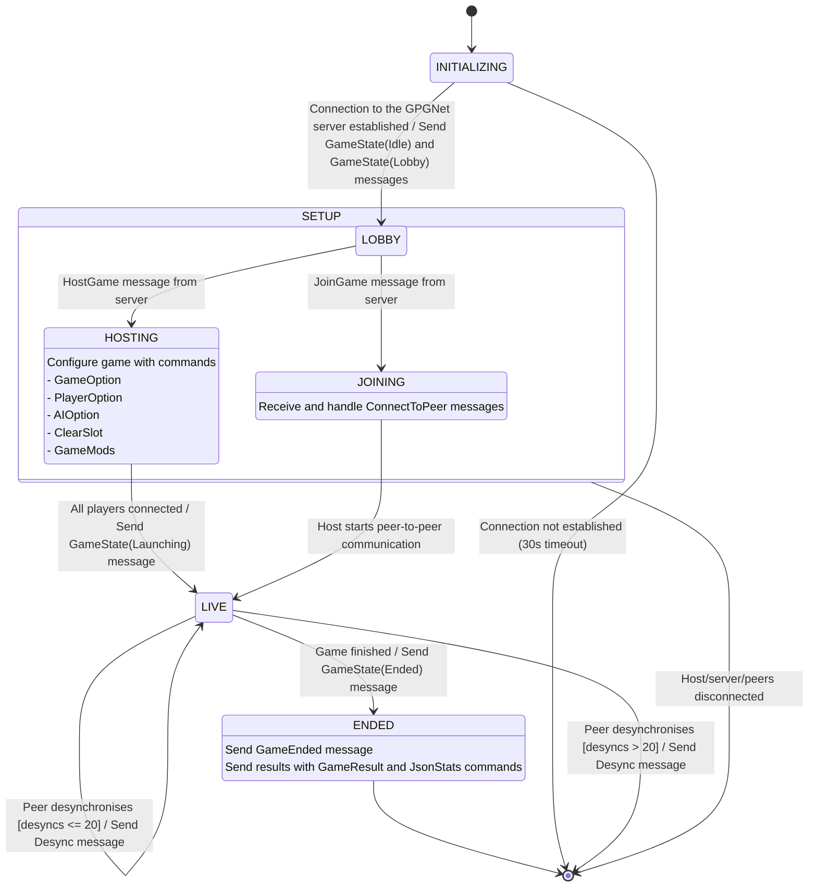
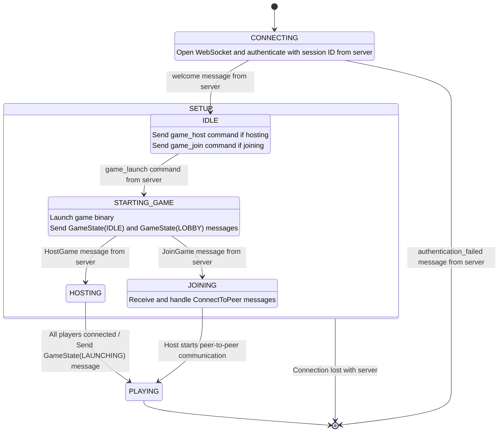

# State Diagram

These are the states and transitions for the mock game and mock client.
These are largely based on the diagrams found in https://github.com/faforever/faf-api-specs

Note that the diagrams on that page are from the point of view of the server, and therefore do not present a complete picture of how each component behaves.
Also of note, most/all information on those pages was AI generated and has not been double-checked by FAF developers.
We have confirmed all information against the actual FAF server code.

In this document (and in FAF development in general) `CamelCase` messages represent GPGNet commands, while `snake_case` messages represent lobby messages.

## Game State Machine

The mock game has 6 states:
| State        | Description                         |
|--------------|-------------------------------------|
| INITIALIZING | Connecting to the server            |
| LOBBY        | Waiting on instructions             |
| HOSTING      | Hosting a game, waiting for players |
| JOINING      | Joining a game                      |
| LIVE         | Game simulation running             |
| ENDED        | Ended                               |

*State diagram of the mock game*

## Client State Machine

The mock client has 6 states:
| State         | Description                                                 |
|---------------|-------------------------------------------------------------|
| CONNECTING    | Connecting to the server                                    |
| IDLE          | Waiting for player input (to join or start a game)          |
| STARTING_GAME | Opening game binary, establising necessary connections      |
| HOSTING       | Hosting a game, waiting for players/for user to launch game |
| JOINING       | Join an existing game                                       |
| PLAYING       | Game simulation running                                     |

There are two additional states considered by the server: SEARCHING_LADDER and STARTING_AUTOMATCH.
These are used for ladder/matchmaking games (as opposed to custom games).
While adding this is a feature worth considering, it is not a priority at this moment.

*State diagram of the mock client*
