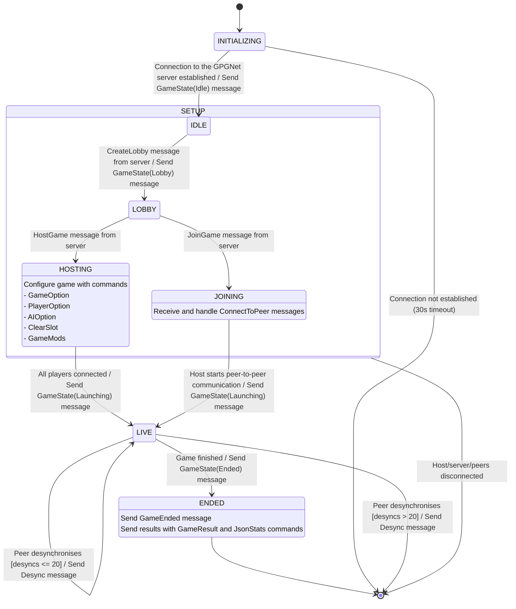
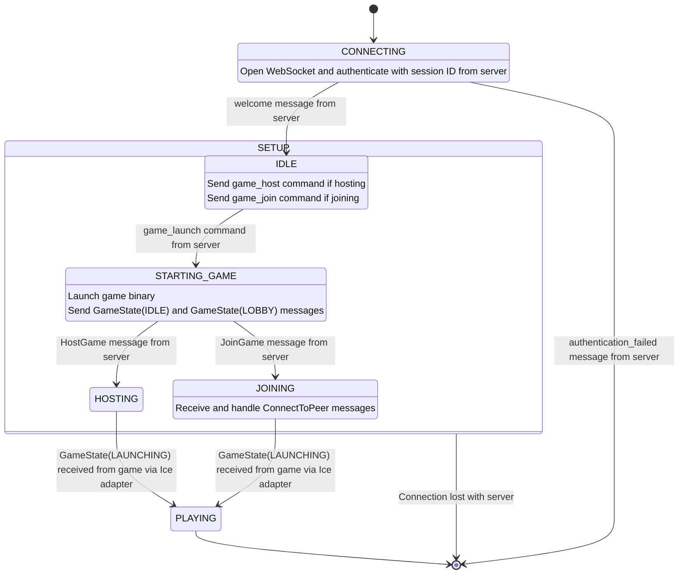

# State Diagram

These are the states and transitions for the mock game and mock client.
These are largely based on the diagrams found in https://github.com/faforever/faf-api-specs

Note that the diagrams on that page are from the point of view of the server, and therefore do not present a complete picture of how each component behaves.
Also of note, most/all information on those pages was AI generated and has not been double-checked by FAF developers.
We have confirmed all information against the actual FAF server code.

In this document (and in FAF development in general) `CamelCase` messages represent GPGNet commands, while `snake_case` messages represent lobby messages.

## Game State Machine

The mock game has 7 states:
| State        | Description                         |
|--------------|-------------------------------------|
| INITIALIZING | Connecting to the server            |
| IDLE         | Waiting to create for lobby config  |
| LOBBY        | Waiting on instructions             |
| HOSTING      | Hosting a game, waiting for players |
| JOINING      | Joining a game                      |
| LIVE         | Game simulation running             |
| ENDED        | Ended                               |

*State diagram of the mock game*

### Operational Failure

Any disconnection from peers or the server causes the game to enter an unrecoverable failure state (shown in the diagram as a transition directly to the end state).
After this occurs, the client initiates tear-down of the game process, ensuring any remaining connections are closed and the game binary is killed.
Disconnection may occur from ICE adapter crashes, ICE negotiation timeouts, game-process hangs (from peers), a lost internet signal, or any other source. The game treats all of these sources the same.

## Client State Machine

The mock client has 6 states:
| State         | Description                                                 |
|---------------|-------------------------------------------------------------|
| CONNECTING    | Connecting to the server                                    |
| IDLE          | Waiting for player input (to join or start a game)          |
| STARTING_GAME | Opening game binary, establising necessary connections      |
| HOSTING       | Hosting a game, waiting for players/for user to launch game |
| JOINING       | Join an existing game                                       |
| PLAYING       | Game simulation running                                     |

There are two additional states considered by the server: SEARCHING_LADDER and STARTING_AUTOMATCH.
These are used for ladder/matchmaking games (as opposed to custom games).
While adding this is a feature worth considering, it is not a priority at this moment.

*State diagram of the mock client*

### Operational Failure

If, during the CONNECTING state, the server and client are unable to authenticate a connection (for example due to incorrect credentials),
the client has no choice but to exit (with a message to the user).

Similarly, if at any point before the actual game starts running (during the SETUP stage) connection with the server is lost, the client is unable to continue, and it must restart from the beginning.
After SETUP, all communication occurs through peer-to-peer game binaries, and the server connection is not necessary.

The connection between server and client is tested with ping messages every 45 seconds, to guarantee that it is still functioning.
A missing pong message after a given timeout is what triggers the transition from SETUP to failure state.

## Client-Game Coupling

The state diagram for the game and client have many similarities (these are not a coincidence!).
After the client establishes a connection with the server and initial setup is completed,
the server instructs the client to initiate the game binary (with the `game_lauch` message).
Afterwards, most state transitions (in both the game and client) are driven by GPGNet messages exchanged between game and server.
Therefore, most states in the client after `STARTING_GAME` are highly coupled to states in the game:

|Client                 | Game                                |
|-----------------------|-------------------------------------|
| `STARTING_GAME`       | `INITIALIZING`, `IDLE`, and `LOBBY` |
| `HOSTING` / `JOINING` | `HOSTING` / `JOINING`               |
| `PLAYING`             | `LIVE` and `ENDED`                  |

The client is responsible for starting and managing the lifecycle of a game binary instance.
Teardown of the game binary is always client-led, regardless of whether it is due to timeouts, disconnections, normal execution, or process exit.
