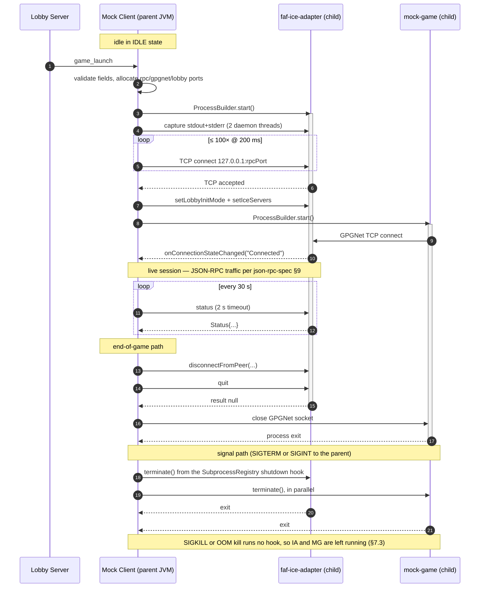

# Subprocess Orchestration Spec

This document is the Mock Client's contract for managing its two child
processes `faf-ice-adapter` (the real upstream Java JAR) and `mock-game`
(our sibling Gradle module). It complements `json-rpc-spec.md` (which covers
the IPC wire protocol on `127.0.0.1:7236`).

Scope: process lifecycle only — launch, output capture, health, teardown.
The JSON-RPC traffic itself is out of scope here.

> **Source of truth.** CLI flags are checked against the pinned 3.3.14
> adapter's `IceOptions` (the upstream [`java-ice-adapter` README][readme]
> option list is stale at that version, see §2.6); the example startup
> sequence is taken from that README. The supervision
> pattern is informed by the real client's
> [`IceAdapterImpl.java`][downlords-iceadapter] in `downlords-faf-client`.

[readme]: https://github.com/FAForever/java-ice-adapter
[downlords-iceadapter]: https://github.com/FAForever/downlords-faf-client/blob/develop/src/main/java/com/faforever/client/fa/relay/ice/IceAdapterImpl.java

---

## 1. Subprocess inventory

| Child | Binary | Role | Launch trigger |
|---|---|---|---|
| `faf-ice-adapter` | Real upstream JAR (`faf-ice-adapter.jar`) executed via the same `java` binary running the Mock Client | Bridges GPGNet (TCP, to `mock-game`) and ICE (UDP, to peers); exposes JSON-RPC on `127.0.0.1:--rpc-port` | Receipt of `game_launch` from the lobby (see lobby-protocol-spec §4.4) |
| `mock-game` | Sibling Gradle module's `application` distribution — `mock-game/build/install/mock-game/bin/mock-game` (or `java -jar` against its shadow JAR) | Stands in for the Forged Alliance executable; opens a TCP client to the adapter's GPGNet port and exchanges UDP via `--lobby-port` | Started **after** the adapter's TCP RPC socket is reachable |

Both children are started by the **Mock Client only**; no other component
spawns subprocesses. The Mock Client is the sole supervisor of both.

### 1.1 Target environment

This spec **targets Linux**, the platform CI runs on (`ubuntu-latest`). The
Java code itself is OS-portable. The unbuilt orphan-prevention layers in §7.3
are designed around `util-linux`: `prctl(PR_SET_PDEATHSIG)` via `setpriv`, and
`setsid` for process-group cleanup.

The harness needs **no container**. Both mocks ship as runnable jars on the
releases page (WBS-7.6) and run as plain processes on a Java 21 or newer
runtime, the way the real client runs `faf-ice-adapter` as a bare
`ProcessBuilder` child. The reasons this section once gave for a Docker
workspace no longer hold:

1. **Fault injection lives in the harness.** WBS-5.1 puts its faults in the
   Mock Client's ICE relay and mock-game's UDP sender, so it needs no `tc`,
   `netem` or `iptables`. harness-runbook §10 explains why network-level tools
   cannot express those faults.
2. **Orphan prevention does not rely on an init process.** The harness JVM is
   not PID 1, and `SubprocessRegistry`'s shutdown hook is the safety net. §7.3
   records what that hook does not cover.
3. **Multi-peer runs on one host.** `mock-client session` runs every peer's
   client in one JVM and allocates each peer's ports itself; clients started as
   separate `run` processes each need their own `--ice-adapter-*-port` values.
   §9 records the decision.

Implementation note: the Subprocess Execution Controller must not bake
container-specific paths or network assumptions into the Java code. Anyone who
wraps the jars in a container keeps that configuration outside the controller.

## 2. Launch strategy

### 2.1 API

`java.lang.ProcessBuilder` (Java 21). Reasons:

- already used by `downlords-faf-client` for the same JAR — known good.
- `List<String>` argv avoids shell metacharacter parsing, sidestepping
  argument-injection concerns when forwarding lobby-supplied values
  (lobby-protocol-spec §5).
- Returns a `Process` whose `toHandle()` exposes `onExit()`,
  `descendants()`, `pid()`, `isAlive()`, and `destroy[Forcibly]()`.

We do not use `Runtime.exec`, no shell-out, no third-party process libraries.

### 2.2 Resolving the `java` binary and JAR path

Mirroring `IceAdapterImpl`:

- **`java` binary**: `command()` returns `Optional<String>` because some
  platforms withhold the path under strict security policies. Use:
  ```java
  String javaBin = ProcessHandle.current().info().command()
          .orElse(System.getProperty("java.home") + "/bin/java");
  ```
  Never rely on `PATH` — this guarantees the child runs on the same JRE as
  the parent (matching what the upstream library set chooses; see
  `libraries.md`).
- **Adapter JAR**: `iceAdapterBinaryPath` (`--ice-adapter-binary-path`, env
  `FAF_MOCK_CLIENT_ICE_ADAPTER_BINARY_PATH`), defaulting to
  `faf-ice-adapter.jar` relative to the Mock Client's working directory. The
  launcher checks that the path is a regular file before launch, so a missing
  JAR fails the launch rather than starting a child.
- **`mock-game`**: launched via the Gradle-installed launcher script (or its
  fat JAR) at a path configured the same way: `mockGameBinaryPath`
  (`--mock-game-binary-path`, env `FAF_MOCK_CLIENT_MOCK_GAME_BINARY_PATH`),
  defaulting to `mock-game/build/install/mock-game/bin/mock-game`.

### 2.3 Environment

`ProcessBuilder.environment()` starts as a copy of the parent. We:

- set `LOG_DIR`, for the adapter only, to the fixed directory
  `logs/ice-adapter/`; the adapter's README documents `LOG_DIR` as the
  supported way to redirect its file output. No parent `LOG_DIR` is read: the
  harness's own output path comes from `LOG_FILE` (`LoggingSetup`). On the
  `.jar` path it redirects nothing, because the injected config below has no
  file appender.
- set `LOG_LEVEL` to the harness's own resolved level, overwriting any
  inherited value, so a child logs at the level mock-client resolved (see
  `LoggingSetup` for that precedence). Upstream does not read it: the pinned
  3.3.14 adapter's bundled `logback.xml` hardcodes `<root level="DEBUG">` and
  substitutes `${LOG_DIR}` only, and neither its README nor its `IceOptions`
  mentions a log level. It takes effect only because the launcher injects a
  console-only logback config whose root level is `${LOG_LEVEL:-INFO}`, and
  that injection happens on the `.jar` path alone. Against a non-jar adapter
  `LOG_LEVEL` is inert. For the adapter the two variables are mirror images:
  `LOG_LEVEL` works only on the jar path, `LOG_DIR` only off it. mock-game,
  our own component, honours `LOG_LEVEL` on every path.
- do **not** scrub other env vars. The children run as the same OS user as
  the Mock Client, so they gain nothing it does not already have.

### 2.4 Working directory

**Intended, not implemented.** The design is a per-session scratch directory
(e.g. `/tmp/harness/<sessionId>/<child>/`), created before launch and set with
`ProcessBuilder.directory(...)`, isolating what a child writes (its own log
fallback, dump files) from the harness CWD.

No launcher calls `directory(...)` today, so every child inherits the harness's
working directory, and the relative paths in §2.3 resolve against it: two
harness instances started in one directory share `logs/ice-adapter/`.
`IceAdapterLauncher`'s javadoc records the same gap and points back here.

### 2.5 Stream wiring

- `redirectErrorStream(false)` — keep stdout and stderr separate so the
  capture layer can tag them at different SLF4J levels (INFO vs WARN). The
  adapter emits human-readable text on both streams, so loss of ordering is
  acceptable and merging would discard level information.
- No `Redirect.INHERIT` and no `Redirect.to(File)` — both streams stay piped
  into the parent so they can be captured. **Mandatory:** the OS pipe
  buffers (Linux ≈ 64 KiB) fill within seconds under verbose logging, and
  an undrained pipe blocks the child mid-`write(2)`. The capture layer (§4)
  drains them on dedicated threads.

### 2.6 ICE adapter CLI arguments

The adapter's options at the pinned 3.3.14, checked against its `IceOptions`
class. The [upstream README's "Commandline invocation"][readme] list is stale
at that version: it omits `--game-id`, `--ping-count`, `--acceptable-latency`
and `--telemetry-server`, and still lists `--log-directory`, which 3.3.14 does
not have. Bold flags are passed by the Mock Client on every launch.

| Flag | Default | Required | Notes |
|---|---|---|---|
| **`--id <int>`** | — | yes | Local player id. Sourced from `welcome.me.id` cached at lobby auth time (json-rpc-spec §8.1). |
| **`--login <string>`** | — | yes | Local player login. Sourced from `welcome.me.login`. |
| **`--game-id <int>`** | — | yes | Game id. **Required by adapter 3.3.x** — it prints usage and exits without it. Sourced from `game_launch.uid`; a placeholder (`iceAdapterGameId`, default 0) for the standalone diagnostics. |
| **`--rpc-port <int>`** | 7236 | yes (explicit) | TCP port for the JSON-RPC server. The configured value, `7236` unless moved; only `session` allocates a free port per peer (§3), so two other harness commands on one host collide unless one is moved (runbook §2a, **Ports**). |
| **`--gpgnet-port <int>`** | 0 (auto) | yes (explicit) | TCP port for the adapter's internal GPGNet server. The Mock Client picks the port and passes the same value to `mock-game --gpgnet-port`. |
| **`--lobby-port <int>`** | 0 (auto) | yes (explicit) | UDP port the game lobby uses for game traffic. Mock Client picks it and forwards to `mock-game --lobby-port`. |
| **`--telemetry-server <url>`** | `wss://ice-telemetry.faforever.com` | yes (explicit) | Websocket the adapter opens to FAF's ICE telemetry service on launch. No clean disable at 3.3.14 (json-rpc-spec §8). The Mock Client passes FAF's test service, `wss://ice-telemetry.faforever.xyz` (`IceAdapterLauncher.TELEMETRY_SERVER`), so no harness launch reports to production. |
| `--log-directory <path>` | unset | no | Not present at the pinned 3.3.14; only the upstream README's help text still lists it, as deprecated. The adapter accepts unknown arguments, so passing it is silently ignored. Use the `LOG_DIR` env var (§2.3). |
| `--force-relay` | off | no | Relay-only ICE candidates. Reserved for fault-injection (WBS 3.x); not set by default. |
| `--debug-window` / `--info-window` / `--delay-ui <ms>` | off | no | JavaFX UI flags; upstream opens the windows only if JavaFX is available. **Never set: the harness runs headless.** |
| `--ping-count <int>` | `1` | no | Pings sent to each ICE server to measure its round-trip time; `0` skips the measurement. Not set by the Mock Client. |
| `--acceptable-latency <double>` | `250.0` | no | Round-trip-time threshold: ICE servers measured below it, or not measured, are tried first (`IceServer.hasAcceptableLatency`). Upstream's `--help` text for this flag repeats `--ping-count`'s. Not set by the Mock Client. |
| `--help` | — | no | Diagnostic only. |

The Mock Client emits `--id` and `--login` first, with `--game-id`
immediately after. The 3.3.x parser is picocli and order-independent in
practice (verified), but keeping the identity flags first matches the
upstream synopsis. The `.jar` adapter additionally needs a
`-Dlogback.configurationFile` override to run headless (see §2.7 and
json-rpc-spec §8).

Those three identity values have two sources (WBS-3.1.2.9, implemented).
An orchestrated `run` passes a `LaunchIdentity` built from `welcome.me.id`,
`welcome.me.login`, and `game_launch.uid`. The standalone `launch-ice`
diagnostic has no lobby, so it falls back to `playerIdOverride`,
`playerLogin`, and `iceAdapterGameId` (default 0). That fallback is the only
place `playerIdOverride` applies, because a session launch is bound to the
identity the lobby assigned.

The adapter half is the one that matters. faf-ice-adapter copies `--login`
and `--id` straight into the GPGNet `CreateLobby(initMode, lobbyPort, login,
id, 1)` frame it sends the game (verified in java-ice-adapter 3.3.14,
`GPGNetServer`), which is the game's authoritative view of its own identity,
and it keys its telemetry on the same pair. It does **not** affect `ice_msg`
routing. The lobby server stamps the sender from its own authenticated
session and the client routes on the peer id from `ConnectToPeer`, so a
wrong `--id` cannot misdirect signalling.

Caveat worth knowing when handling launch failures. On a usage error the
adapter prints usage and exits **0**, because its `main` discards picocli's
return value rather than calling `System.exit`. A missing `--game-id`
therefore never shows up as a non-zero exit code. Detect a failed launch by
the process exiting before its RPC port accepts a connection (§2.7, #341), or
by the connect timeout when it stays up without binding. `run` reports either
as a failed launch and exits `70` (#437).

### 2.7 ICE adapter startup sequence

The example below mirrors json-rpc-spec §9 phases A–B.

```text
1. Allocate three TCP ports + one UDP port:
       rpcPort      ← free TCP port
       gpgnetPort   ← free TCP port
       lobbyUdpPort ← free UDP port
   (See §3 — bind-and-release pattern.)

2. ProcessBuilder argv =
   [ javaBin,
     "-Dlogback.configurationFile=<console-only config>",  // headless: bypass JavaFX appender
     "-jar", iceAdapterJar,
     "--id",          welcome.me.id,
     "--login",       welcome.me.login,
     "--game-id",     game_launch.uid,   // required by 3.3.x
     "--rpc-port",    rpcPort,
     "--gpgnet-port", gpgnetPort,
     "--lobby-port",  lobbyUdpPort,
     "--telemetry-server", "wss://ice-telemetry.faforever.xyz" ]  // FAF's test service (§2.6)
   env  += LOG_DIR=logs/ice-adapter/, LOG_LEVEL=<mock-client's resolved level>
   cwd   = <inherited from the harness; see §2.4>
   redirectErrorStream(false)

3. SubprocessManager ice = SubprocessManager.start(pb, "ICEAdapter", grace);
   ← starts the process, drains both streams via ProcessOutputLogger,
     registers in SubprocessRegistry (installs JVM shutdown hook once).
4. Connect-retry loop: TCP connect 127.0.0.1:rpcPort, 1 s connect timeout
   per attempt, 200 ms backoff, max 100 attempts, total ≤ 20 s where the
   port refuses, about 120 s where it drops the connect. See the correction
   note below.
6. Once connected: setLobbyInitMode(...) → setIceServers(...).
7. Spawn mock-game with the same gpgnetPort and lobbyUdpPort.
```

> **Correction (WBS-3.1.2.7).** Step 4 previously read "250 ms backoff, max 10
> attempts, total ≤ 2.5 s. Mirrors the real client's loop." The backoff was
> right; the attempt count was not, and it did **not** mirror the real client.
> Verified against `downlords-faf-client` v2026.7.1,
> `src/main/java/com/faforever/client/fa/relay/ice/IceAdapterImpl.java`:
>
> ```java
> private static final int CONNECTION_ATTEMPTS = 50;
> private static final int CONNECTION_ATTEMPT_DELAY_MILLIS = 250;
> ```
>
> — i.e. **50 attempts, ≈12.5 s**, five times the budget this spec claimed,
> above a comment reading *"the socket fails too fast on unix/linux not giving
> the adapter enough time to start."* `IceAdapterConnection` had faithfully
> implemented the wrong figure (20 × 100 ms = 2 s); it is now 100 × 200 ms =
> 20 s, deliberately a little above upstream's.
>
> Two upstream details worth knowing but **not** worth copying. On exhausting
> its attempts, `initializeIceAdapterConnection` returns normally leaving
> `peer` null, so the real client fails later and obscurely — our `connect()`
> completes exceptionally instead. And upstream picks ports via
> `new ServerSocket(0)` closed immediately before the adapter binds them, the
> same benign TOCTOU race our live tests carry.
>
> Note the interaction with §2.6: the adapter exits **0** on a usage error, so
> a mis-launch is detected by this connect timeout rather than by an exit code
> — and that detection now costs up to 20 s, inside a `synchronized`
> `StateMachine.receiveEvent`, during which no other event is processed. Same
> shape as before, ten times the window.
>
> **Correction (WBS-3.1.3.3, #266).** The paragraph below counted two bounds;
> there are now three, and the third is what closes this window rather than
> merely bounding it. The bring-up races the connect against the adapter
> process's own exit future, so an adapter that dies on the way up — which is
> exactly the usage-error case this note is about, since it exits `0` while
> doing so — ends the wait the moment the process goes, not when the connect
> budget expires. Measured at roughly 10 ms against the 20 s below. The two
> bounds that follow still hold and still matter for an adapter that stays up
> without ever binding; what no longer holds is "a broken adapter is noticed
> late and `AdapterExited` sits queued for that window", in the common case.
> `IceAdapterConnection.DEFAULT_CONNECT_ATTEMPTS`' javadoc is the code half of
> this correction.
>
> Two things bound that cost, so it is late detection rather than a hang.
> `connectWithRetry` aborts as soon as `close()` is requested, and the CLI's
> signal hook reaches `SessionTeardown` **without** going through the state
> machine (`RunCommand` installs it as a JVM shutdown hook), so a Ctrl-C during
> the connect window takes effect immediately rather than waiting the budget
> out. Separately, `SubprocessRegistry` installs its own JVM shutdown hook, so
> on any exit that runs shutdown hooks both children die with the parent
> whatever the FSM is doing. A `SIGKILL` skips the hook and leaves them running
> (§7.3). What remains of the connect-window cost is that a broken adapter is
> noticed late and `AdapterExited` sits queued for that window. Moving the
> bring-up off the transition action is tracked as a 3.1.3.3 fix.

Steps 6–7 are JSON-RPC and out of scope here; they are listed only to
clarify that the adapter must be observably-reachable before `mock-game` is
launched, otherwise the GPGNet connect would race the adapter's bind.

### 2.8 `mock-game` argv

```text
[ mockGameBin,
  "--gpgnet-port", gpgnetPort,    // TCP, must match adapter
  "--lobby-port",  lobbyUdpPort,  // UDP, fallback only; CreateLobby's port wins
  "--player-id",   welcome.me.id,
  "--player-login", welcome.me.login,
  "--game-uid",    game_launch.uid,
  "--launch-delay-seconds", mockGameLaunchDelaySeconds,
  // only when mockGameUdpDropPercent > 0 (WBS-5.1)
  "--udp-drop-percent", mockGameUdpDropPercent,
  // only when mockGameCrashAfterSeconds >= 0 (WBS-5.2)
  "--crash-after-seconds", mockGameCrashAfterSeconds ]
```

The game-side parser is `MockGameCli` in mock-game's `game.config` package
(WBS-3.2.1.1): strict, unknown arguments rejected, and every argument that
states a *session fact* required and never defaulted.

The behavioural knobs are the defaulted arguments: `--launch-delay-seconds`
(WBS-4.3.1), `--udp-drop-percent` (WBS-5.1), `--lobby-timeout-seconds`
(WBS-3.2.1.3) and `--crash-after-seconds` (WBS-5.2). Every session fact stays
required. Taking the first as the
worked example: it is defaulted because it
is a behavioural knob rather than a session fact: how long the game sits in the
lobby before starting the match on its own, with a negative value meaning it
never does. Its default (5 s, the value `Main` used to hardcode) applies only to
a hand-run binary — `MockGameLauncher` always emits the flag explicitly, from
the client's own `--mock-game-launch-delay-seconds`, and `Main` logs the
effective policy in its startup line either way.

A multi-peer session must pass a negative value **to the host at least**. The
FAF server only accepts a `game_join` while the game is in `GameState.LOBBY`
(`lobbyconnection.command_game_join`) and moves it out of that state as soon as
the host reports `GameState Launching` (`gameconnection._handle_game_state` →
`game.launch()`), so a host that auto-launches on a timer makes its own game
unjoinable while the joiner is still booting its adapter and game.

The two fault-injection arguments are emitted **conditionally**. The launcher
passes `--udp-drop-percent` only when the client's own
`--mock-game-udp-drop-percent` is non-zero, and `--crash-after-seconds` only
when `--mock-game-crash-after-seconds` is non-negative, so an orchestrated run
that asks for no fault produces exactly the argv it produced before either flag
existed. The guards differ because the sentinels do: `--crash-after-seconds`
defaults to `-1`, meaning never, at both ends, and zero is a real value rather
than a second spelling of "off", crashing the moment the game enters a session.
`--lobby-timeout-seconds` is never emitted, so it applies only to a hand-run
binary.

That difference from `--launch-delay-seconds` is deliberate. The launch delay is
always stated because its value decides whether the session's game stays
joinable, so inheriting mock-game's default would be a silent behavioural
choice. A fault is off unless asked for, and stating one everywhere would put
a flag in every argv that does nothing in almost all of them.

All three identity values have the same two sources as the adapter's
(WBS-3.1.2.9, implemented). An orchestrated `run` passes the welcome identity
and the `game_launch` uid. The standalone `launch-game` diagnostic falls back
to `playerIdOverride`, `playerLogin`, and `iceAdapterGameId` (default 0,
meaning no session). `--game-uid` accepts 0 and rejects a negative value.

`--game-uid` is a mock adaptation, not a copy of an upstream flag. The real
client hands Forged Alliance its game uid inside the
`/savereplay gpgnet://<ip>:<port>/<uid>/<login>.SCFAreplay` URL and the `/log`
filename, with no flag of its own. mock-game has neither, so it takes the uid
directly.

#### Deferred `game_launch`-derived flags

An earlier draft of this section listed mod, map, faction, and team as flags
to pass. None are emitted. Verified against downlords-faf-client v2026.7.1 and
FAForever/server, they fall into three groups.

- **`mod` has no argv representation, but is a real `game_launch` field.**
  `_prepare_launch_game` sets `"mod": game.game_mode` as a top-level field, so
  it is always populated and never stripped. The client consumes it to select
  featured-mod binaries, patching, and the init file, which is why it never
  becomes a Forged Alliance argument. Do not read "no flag" as "irrelevant".
  It is the field that matters the moment featured-mod fidelity does.
- **`map` is never passed for an online game.** `LaunchCommandBuilder`'s
  `/map` is reached only from `launchOfflineGame`. The `game_launch` mapname
  is used to pre-download the map, after which FA gets it through the lobby.
- **Faction, team, expected players, start spot, game options, and additional
  args are a real conditional handoff, deferred rather than dismissed.**
  `ForgedAllianceLaunchService.launchOnlineGame` passes all of them on every
  online launch, and `build()` emits each only when non-null. The client does
  not branch on matchmaker. The FAF server produces the difference, since
  `GameLaunchOptions` defaults every field to `None` and `_prepare_launch_game`
  strips every `None` before sending, while ladder and team matchmaking fill
  them in. Track these against whatever grows mock-game's lobby-option
  fidelity. Passing them through the launcher is the mechanism the real client
  uses, so this is a scope decision, not a correctness one.

The Subprocess Execution Controller treats the argv as opaque except for the
two ports it shares with the adapter.

## 3. Port allocation

**Implemented by `session` only, and without the retry.** To avoid
collisions between harness instances sharing one host, the design is:

- Open a `ServerSocket(0)` (TCP) or `DatagramSocket(0)` (UDP), read
  `getLocalPort()`, close, pass the integer to the child.
- Window between close and the child's bind is small but non-zero (TOCTOU
  race). Mitigation: retry-with-fresh-port on the child's "port in use"
  error; cap retries at 3.
- Ports are **per session**, not pooled. The Mock Client never holds a port
  binding alongside the child.

`session` does the first and last of these for every peer
(`MultiPeerSession.freeAdapterPorts`, the one free-port allocator in main
source), but nothing retries with a fresh port, so a collision in that window
fails the run. `run`, `launch-ice` and `ice-smoke` allocate nothing: they pass
the configured ports, which default to `7236`, `7237` and `7238`, so two of
them on one host collide unless one is moved by hand (runbook §2a,
**Ports**).

## 4. stdout / stderr capture

Already implemented as
`com.faforever.testharness.shared.logging.ProcessOutputLogger`
([`ProcessOutputLogger.java`](../../shared/src/main/java/com/faforever/testharness/shared/logging/ProcessOutputLogger.java)).
The Subprocess Execution Controller uses it unchanged.

Properties:

- two daemon threads per child (one per stream) — the only safe pattern
  given the pipe-buffer constraint in §2.5.
- both threads tag every line via SLF4J MDC with the component name passed
  in (`"ICEAdapter"` or `"MockGame"`), so interleaved output remains
  distinguishable in the merged JSONL log.
- stack-trace continuation lines (those starting with `\t` or
  `Caused by:`) are coalesced into one log event. This is essential for the
  adapter, which emits multi-line Java stack traces on stderr during ICE
  failures.
- INFO for stdout, WARN for stderr — preserves stream provenance after the
  log records are merged.
- Daemon threads exit when the streams close (i.e. when the child exits).
  The controller calls `executor.shutdown()` after `process.onExit()` to
  release the pool deterministically.

Routing:

```text
adapter stdout ─┐
adapter stderr ─┼─► ProcessOutputLogger (MDC=ICEAdapter)
                │       │
mock-game out ──┤       ├─► SLF4J ─► logback CONSOLE  (human)
mock-game err ──┘       │            logback FILE     (JSONL, per-component file)
```

## 5. `SubprocessManager` — lifecycle wrapper (WBS 3.1.2.1)

`SubprocessManager` is the implemented abstraction that bundles §2 (start),
§4 (capture), §6.1 (exit hook), and §7.2 (forceful teardown) into a single
object so individual launchers do not repeat the wiring.

Source:
[`shared/.../process/SubprocessManager.java`](../../shared/src/main/java/com/faforever/testharness/shared/process/SubprocessManager.java).

### 5.1 API

```java
// Launch — replaces §2.7 steps 3–4
SubprocessManager ice = SubprocessManager.start(
        pb,                        // fully-configured ProcessBuilder (§2.7 steps 1–2)
        "ICEAdapter",              // MDC component tag — appears in every log line
        Duration.ofSeconds(5));    // grace between SIGTERM and SIGKILL

// Accessors
long        pid   = ice.pid();
boolean     alive = ice.isAlive();
OptionalInt code  = ice.exitCode();   // empty while running

// Exit hook — §6.1 liveness signal
ice.onExit().thenAccept(exitCode -> {
    // Emit SubprocessExited FSM event here.
    // If shuttingDown == false this exit was unexpected — alert the FSM.
});

// Teardown — §7.2
ice.terminate();                        // uses the grace passed to start()
ice.terminate(Duration.ofSeconds(2));   // per-call override
```

`onExit()` returns an independent copy each call; cancelling or completing one
copy does not affect internal cleanup or other listeners.

### 5.2 Mapping to spec sections

| Spec concern | How `SubprocessManager` covers it |
|---|---|
| §2.5 stream wiring, §4 capture | `start()` calls `ProcessOutputLogger.captureAsync(p, tag)` — no manual wiring needed |
| §6.1 process liveness | `onExit()` chains a `CompletableFuture<Integer>` off `Process.onExit()` |
| §7.2 forceful teardown | `terminate([grace])` — SIGTERM → wait → SIGKILL |
| §7.3 layer 1 shutdown hook | `SubprocessRegistry` tracks all active managers and calls `terminate()` on each **in parallel** when the JVM exits |

### 5.3 Launcher pattern (ICE adapter and mock-game)

Each launcher (WBS 3.1.2.2, 3.1.2.3) holds one `SubprocessManager` field and
follows this sequence:

```java
// 1. Configure ProcessBuilder per §2.6 / §2.8
ProcessBuilder pb = new ProcessBuilder(argv);
pb.environment().put("LOG_DIR", "logs/ice-adapter/");
pb.directory(sessionScratchDir);
// Note: do NOT call redirectErrorStream — SubprocessManager keeps streams
//       separate so stderr can be routed to WARN (§4 routing diagram).

// 2. Start — one call replaces §2.7 steps 3–4
iceAdapter = SubprocessManager.start(pb, "ICEAdapter", Duration.ofSeconds(5));
LOG.info("ICE adapter started pid={}", iceAdapter.pid());

// 3. Wire unexpected-exit reaction before any await
AtomicBoolean shuttingDown = new AtomicBoolean();
iceAdapter.onExit().thenAccept(code -> {
    if (!shuttingDown.get()) {
        fsm.post(new SubprocessExited("ICEAdapter", code));
    }
});

// 4. Connect-retry loop (§2.7 steps 5–6) — JSON-RPC, out of scope here

// 5. Graceful teardown (§7.1)
shuttingDown.set(true);   // set BEFORE terminate so the callback sees it
iceAdapter.terminate();
iceAdapter.onExit().get(10, TimeUnit.SECONDS);
```

A runnable self-contained demonstration lives at
`mock-client/.../examples/SubprocessManagerExample.java`
(Gradle task `:mock-client:runSubprocessExample`).

## 6. Health monitoring

Two independent signals; either one transitioning to "unhealthy" triggers
session teardown:

### 6.1 Process liveness

`SubprocessManager.onExit()` exposes the JDK process-exit future. Each
launcher chains a completion handler on it that:

1. logs the exit code and elapsed runtime,
2. emits a `SubprocessExited` event into the FSM,
3. for the adapter: closes the JSON-RPC socket so the protocol layer
   surfaces a `ChannelClosed` rather than hanging.

`SubprocessManager` itself performs none of these — they are launcher
responsibilities. The manager only shuts down its reader executor and
deregisters from `SubprocessRegistry` when the process exits; everything
else is wired by the consuming launcher (see §5.3).

Crashes are observed within milliseconds; no polling required for liveness.

### 6.2 Hung-process detection (RPC-level health check)

A pure liveness check is insufficient — the adapter can be alive but stuck
(e.g. internal STUN call deadlock). The Mock Client polls
`status` (json-rpc-spec §4) every **30 s** with a **2 s** read timeout.

| Outcome | Action |
|---|---|
| Response ≤ 2 s | OK, log Status at DEBUG. |
| Timeout | First miss: log WARN. Second consecutive miss: declare adapter hung, escalate to teardown. |
| RPC error | Log WARN with code; treat as miss. |
| Socket EOF | Adapter is dead — handled by §6.1 path. |

`mock-game` has no equivalent introspection RPC; its health is inferred
from (a) liveness via `onExit()`, and (b) GPGNet `GameState` frames
arriving via the adapter at expected cadence (FSM-driven, not implemented
in the controller).

## 7. Teardown strategy

The teardown sequence has three layers, each a fallback for the previous.

### 7.1 Graceful (preferred path, json-rpc-spec §9 phase K)

```text
1. MC → adapter: disconnectFromPeer(id) per peer  (best-effort)
2. MC → adapter: quit
3. Wait up to 5 s for process.onExit().
4. MC → mock-game: shutdown signal (TBD — likely close GPGNet socket;
                   mock-game treats EOF as its own teardown trigger).
5. Wait up to 5 s for mock-game onExit().
```

### 7.2 Forceful (any graceful step fails or times out)

```text
6. process.destroy()  — POSIX SIGTERM. Wait up to 3 s.
7. process.destroyForcibly() — POSIX SIGKILL. Wait up to 2 s.
8. Log ERROR if still alive after 10 s total; abandon and continue.
```

Total bounded teardown ≤ ~15 s per child.

### 7.3 Catastrophic (parent dying)

This is the orphan-prevention layer. It is the failure mode the acceptance
criterion specifically calls out: **"forcefully killing the parent process
results in all children being terminated."** Java alone cannot guarantee
this — when the JVM is killed by `SIGKILL`, the OOM-killer, or
`Runtime.halt()`, **shutdown hooks do not run** and child processes survive
as orphans (they are reparented to PID 1).

The design has four layers, and **only layer 1 is built**. Layers 2 and 4 are
primitives that were designed but never added to the launch argv. Layer 3
applies only when the JVM is PID 1, as in a container; the harness runs as
plain processes, so it does not apply.

| Layer | Mechanism | Covers | Provided by | Status |
|---|---|---|---|---|
| 1. JVM-controlled exit | `Runtime.addShutdownHook` in `SubprocessRegistry` that runs §7.2 `terminate()` on every tracked child in parallel (`run` and `session` each add their own hook for the §7.1 teardown) | `System.exit`, `SIGTERM`, `SIGINT`, last-non-daemon-thread | Mock Client (Java) | **Built.** `SubprocessManagerShutdownTest` covers `SIGTERM` |
| 2. Parent-death signal | Linux `prctl(PR_SET_PDEATHSIG, SIGTERM)` set in a tiny native shim that `execve`s the actual child | Parent dies via `SIGKILL` while children are running | Linux kernel + `util-linux` (`setpriv`) | Designed, not built |
| 3. Init / PID 1 | An init (e.g. tini) at PID 1 that reaps zombies and forwards signals to the JVM | The harness JVM being PID 1 (no zombie reaping, no signal forwarding) | A container runtime | Not applicable: the harness runs as plain processes, so its JVM is not PID 1 |
| 4. Process-group cleanup | Children launched via `setsid` into their own session and process group | A child's own descendants, which a signal to the child's PID does not reach | `util-linux` (`setsid`) | Designed, not built |

For layer 2, the JDK does not expose `prctl`. Acceptable
implementations (in order of preference):

- **`setsid`/`setpriv` shim**: launch the child via
  `["setpriv", "--pdeathsig", "TERM", "--", javaBin, "-jar", ...]`. `setpriv`
  is part of `util-linux`. Zero JNI, zero native code in our codebase.
- **Fallback (no `setpriv` available)**: a small Bash launcher script that
  writes its PID to a file and `exec`s the child; a parent-side watchdog
  thread polls `/proc/<parent>/stat` and signals the group on parent death.
  This is a fallback only — the `setpriv` path is preferred.
- **JNA prctl**: explicitly rejected for this PoC. Adds a native dependency
  for one syscall.

For layer 4, prefix the argv with `setsid -w` (also `util-linux`). The
resulting child is the leader of a new session, so `kill -- -<pgid>` delivers
SIGTERM to every descendant in one syscall.

Net effect today: a polite exit of the Mock Client JVM (`SIGTERM`, `SIGINT`,
`System.exit`) terminates its children through layer 1. A `SIGKILL` or OOM
kill of that JVM runs no hook, and nothing else in the harness terminates the
children, so they are left running. The adapter normally never notices:
faf-ice-adapter 3.3.14's JSON-RPC library runs the connection-loss handler only
when a read throws (JJsonRpc `JJsonPeer.run`), and a killed client's socket
closes in an orderly way unless it had unread data, so the adapter carries on
with its GPGNet server still serving the game. Observed against 3.3.14 on a
headless host: live, the adapter stayed up with the client killed in `HOSTING`
and in `PLAYING`; locally, with the adapter's only JSON-RPC client killed while
the game was in `LOBBY` and after `HostGame`, it also logged no connection loss
and kept the game connected. If a read does throw, for example on a reset, the
handler in `RPCService.init` still leaves the adapter up on a headless host. It
stays up by design while the game state is `Launching`; otherwise it throws
before `System.exit`, with a `NullPointerException` if no game is connected, or
at the unguarded `TrayIcon.close()` after closing the game's connection.

mock-game keeps running too, and while the adapter holds its connection only
its own timers can end it. In `LOBBY` it has none: the launch timer is armed
only by `HostGame` or `JoinGame`, which the adapter sends only when its client
asks, and `--lobby-timeout-seconds`, which `MockGameLauncher` does not pass,
defaults to waiting indefinitely. A Mock Client killed before it gives the game
a role therefore leaves mock-game in `LOBBY` indefinitely, whatever the launch
delay; the adapter still moves it out of `IDLE` by sending `CreateLobby` itself.
Once hosting or joining, mock-game ends when its launch and match timers finish,
unless auto-launch is off, as `mock-client session` sets it for every peer and a
negative `--mock-game-launch-delay-seconds` sets it for `run`; then it also
waits indefinitely. It ends at once if the adapter closes its connection, and
within 30 s if the connection never comes up.

### 7.4 Process tracking

Implemented as `SubprocessRegistry` (package-private, `shared/.../process/`).
Internally a `ConcurrentHashMap`-backed `Set<SubprocessManager>`; managers are
added by `SubprocessManager.start()` and removed automatically when their
`onExit()` future completes. The JVM shutdown hook (§7.3 layer 1) iterates this
set and calls `terminate()` on each manager **in parallel**, so total shutdown
wall-clock time is bounded by the longest single grace rather than their sum.

## 8. Failure modes

| Symptom | Source | Detection | Response |
|---|---|---|---|
| Adapter binary missing | wrong path | the launcher's regular-file check, before any process starts | Abort session, surface to FSM as launch failure; `run` exits `70` |
| Adapter exits immediately, with `0` either way | bad CLI args (§2.6), GPGNet port in use (`BindException`, then its own shutdown NPEs on the unstarted RPC server) | `onExit()` before the RPC connect completes (§2.7) | Log args, abort session, surface to FSM as launch failure; `run` exits `70` |
| Adapter alive but never accepts RPC | crash mid-init | connect-retry loop in §2.7 step 4 exhausts | Tear down (§7.1 → §7.2), abort session as a launch failure; `run` exits `70` |
| Adapter's RPC port already held by another process | a stale process, or a port collision | the adapter logs `Could not start RPC server.`, its listener thread dies and it stays up serving GPGNet only, so the connect succeeds against whatever holds the port and the first setup call times out after 5 s | Tear down (§7.1 → §7.2), abort session as a launch failure; `run` exits `70` |
| Adapter hangs mid-session | internal deadlock | `status` poll (§6.2) | §7.1 → §7.2 |
| `mock-game` exits before `GameState("Ended")` | mock-game crash | `onExit()` while FSM is in PLAYING | Forward as `GameEnded(crash)` to lobby; tear down adapter |
| Pipe buffer blocks the child | bug — capture thread died | child stops emitting log lines for ≥ 30 s while RPC traffic continues | Detected in PoC stress test; capture failure logs an ERROR |
| Parent JVM SIGKILL'd | OOM kill, `kill -9` | None: a killed JVM runs no hook | Children are left running (§7.3) |

## 9. Open questions

- **`mock-game` graceful shutdown signal.** §7.1 step 4 assumes EOF on the
  GPGNet socket is the trigger. The mock-game CLI/lifecycle must confirm
   this; otherwise an explicit `--shutdown` admin port or
  a SIGTERM-on-stdin convention is needed.
- ~~**Per-host sessions vs per-container.**~~ **Resolved — Java orchestrator is
  the target, not Docker-compose.** The client spec (`project-spec.md`) lists
  "Create test harness that spawns N clients automatically" as an explicit goal,
  and requires "simulate 2–4 players locally" with no mention of containers.
  Docker-compose multi-peer was our extrapolation, not a client requirement. The
  intended topology is a JVM-based orchestrator module that spawns N Mock Client
  instances via `SubprocessManager` (which is therefore correctly placed in
  `shared/`). Port allocation in §3 applies per-instance; no shared registry is
  needed as long as each Mock Client binds its own ports independently.

  **Amended by WBS-4.2.1 (#87): the clients run in-process.** The orchestrator
  that shipped, `MultiPeerSession` behind `mock-client session`, runs N
  `MockClientLifecycle`s in one JVM. Each peer's adapter and game are still
  launched through `SubprocessManager`, so every client, adapter and game is a
  separate process from the other kinds, which is how this project reads the
  brief's "run all components in separate processes". Only the clients share a
  process with each other. Chosen because it reuses 4.3.3's orchestration and
  instance labels, passes the host's game uid and the mesh verdict in-process
  instead of needing a new handoff and a peer-link exit code on `run`, and at
  16 peers keeps 16 client JVMs out of the scale ceiling it is meant to find.
  The cost is fate sharing (an OOM or stuck lock ends every peer) and that
  interference between clients through shared JVM state is not exercised.
  Running each client as its own `run` process with `INSTANCE_NAME` stays
  available by hand (`mock-client/README.md`, "Multiple clients on one box").
  Port allocation is per peer, inside the orchestrator, as above.

## 10. Sources

- [java-ice-adapter README — Commandline invocation, Example usage sequence](https://github.com/FAForever/java-ice-adapter)
- [`downlords-faf-client` — `IceAdapterImpl.java`](https://github.com/FAForever/downlords-faf-client/blob/develop/src/main/java/com/faforever/client/fa/relay/ice/IceAdapterImpl.java)
- [`OsUtils.gobbleLines`](https://github.com/FAForever/downlords-faf-client/blob/develop/src/main/java/com/faforever/client/util/OsUtils.java) — stream draining pattern
- `documentation/research/json-rpc-spec.md` §§8–9 — CLI flags table and lifecycle ordering
- `documentation/research/lobby-protocol-spec.md` §4.4, §5 — orchestration trigger and `game_launch` fields
- [`shared/.../logging/ProcessOutputLogger.java`](../../shared/src/main/java/com/faforever/testharness/shared/logging/ProcessOutputLogger.java) — output capture implementation
- `util-linux` `setpriv(1)`, `setsid(1)` — orphan prevention primitives
- [java-ice-adapter 3.3.14 `RPCService.java`](https://github.com/FAForever/java-ice-adapter/blob/3.3.14/ice-adapter/src/main/java/com/faforever/iceadapter/rpc/RPCService.java): adapter behaviour on losing its JSON-RPC client
- [JJsonRpc `JJsonPeer.java` at `37669e0`](https://github.com/FAForever/JJsonRpc/blob/37669e0fed05937b733bbb64155bcb874ed07c35/src/main/java/com/nbarraille/jjsonrpc/JJsonPeer.java): the read loop that decides whether faf-ice-adapter 3.3.14 notices a lost JSON-RPC client

## 11. Sequence diagram — one-session lifecycle


