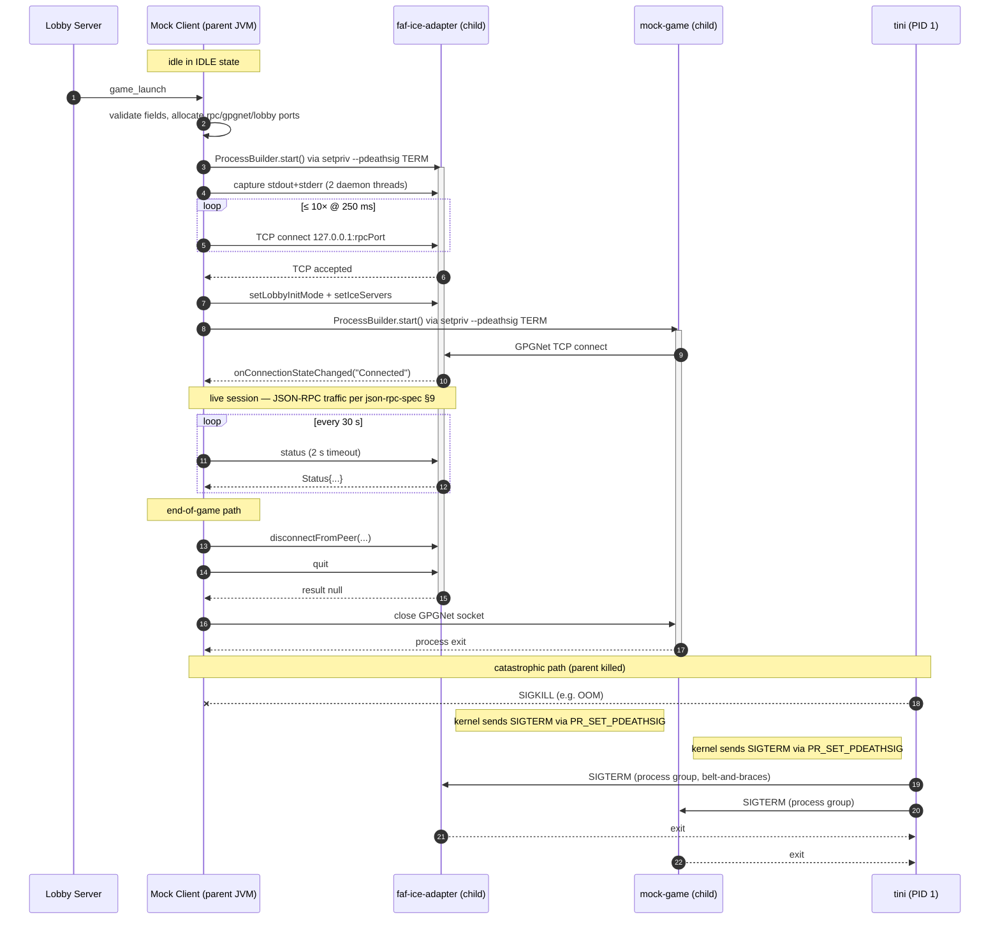

# Subprocess Orchestration Spec

This document is the Mock Client's contract for managing its two child
processes — `faf-ice-adapter` (the real upstream Java JAR) and `mock-game`
(our sibling Gradle module). It complements `json-rpc-spec.md` (which covers
the IPC wire protocol on `127.0.0.1:7236`) and is the prerequisite for WBS
3.1.2 _Subprocess Execution Controller_.

Scope: process lifecycle only — launch, output capture, health, teardown.
The JSON-RPC traffic itself is out of scope here.

> **Source of truth.** CLI flags and the example startup sequence are taken
> from the upstream [`java-ice-adapter` README][readme]. The supervision
> pattern is informed by the real client's
> [`IceAdapterImpl.java`][downlords-iceadapter] in `downlords-faf-client`.

[readme]: https://github.com/FAForever/java-ice-adapter
[downlords-iceadapter]: https://github.com/FAForever/downlords-faf-client/blob/develop/src/main/java/com/faforever/client/fa/relay/ice/IceAdapterImpl.java

---

## 1. Subprocess inventory

| Child | Binary | Role | Launch trigger |
|---|---|---|---|
| `faf-ice-adapter` | Real upstream JAR (`faf-ice-adapter.jar`) executed via the same `java` binary running the Mock Client | Bridges GPGNet (TCP, to `mock-game`) and ICE (UDP, to peers); exposes JSON-RPC on `127.0.0.1:--rpc-port` | Receipt of `game_launch` from the lobby (see lobby-protocol-spec §4.4) |
| `mock-game` | Sibling Gradle module's `application` distribution — `mock-game/build/install/mock-game/bin/mock-game` (or `java -jar` against its shadow JAR) | Stands in for the Forged Alliance executable; opens a TCP client to the adapter's GPGNet port and exchanges UDP via `--lobby-port` | Started **after** the adapter's TCP RPC socket is reachable |

Both children are started by the **Mock Client only**; no other component
spawns subprocesses. The Mock Client is the sole supervisor of both.

## 2. Launch strategy

### 2.1 API

`java.lang.ProcessBuilder` (Java 21). Reasons:

- already used by `downlords-faf-client` for the same JAR — known good.
- `List<String>` argv avoids shell metacharacter parsing, sidestepping
  argument-injection concerns when forwarding lobby-supplied values
  (lobby-protocol-spec §5).
- Returns a `Process` whose `toHandle()` exposes `onExit()`,
  `descendants()`, `pid()`, `isAlive()`, and `destroy[Forcibly]()`.

We do not use `Runtime.exec`, no shell-out, no third-party process libraries.

### 2.2 Resolving the `java` binary and JAR path

Mirroring `IceAdapterImpl`:

- **`java` binary**: `ProcessHandle.current().info().command().orElse(...)`
  → fall back to `${java.home}/bin/java`. Never rely on `PATH`. This
  guarantees the child runs on the same JRE as the parent (matching what the
  upstream library set chooses; see `libraries.md`).
- **Adapter JAR**: configurable via env var `ICE_ADAPTER_JAR` (preferred for
  Docker), falling back to `./faf-ice-adapter.jar` relative to the Mock
  Client's working directory. Path is canonicalised and existence-checked
  before launch; missing JAR is a fatal startup error, not a runtime fault.
- **`mock-game`**: launched via the Gradle-installed launcher script (or its
  fat JAR) at a path discovered the same way (env var `MOCK_GAME_BIN`
  with a sensible default for the Docker image).

### 2.3 Environment

`ProcessBuilder.environment()` starts as a copy of the parent. We:

- set `LOG_DIR` to a per-child directory under `${LOG_DIR:-logs}/<child>/`;
  the adapter's README documents `LOG_DIR` as the supported way to redirect
  its file output (the `--log-directory` flag is deprecated upstream).
- pass `LOG_LEVEL` through unchanged so children inherit the harness log
  level (see `LoggingSetup`).
- do **not** scrub other env vars; the Docker image is the security
  boundary.

### 2.4 Working directory

`ProcessBuilder.directory(...)` is set to a per-session scratch directory
(e.g. `/tmp/harness/<sessionId>/<child>/`), created before launch. This
isolates any files the adapter writes (its own log fallback, dump files)
from the harness CWD.

### 2.5 Stream wiring

- `redirectErrorStream(false)` — keep stdout and stderr separate so the
  capture layer can tag them at different SLF4J levels (INFO vs WARN). The
  adapter emits human-readable text on both streams, so loss of ordering is
  acceptable and merging would discard level information.
- No `Redirect.INHERIT` and no `Redirect.to(File)` — both streams stay piped
  into the parent so they can be captured. **Mandatory:** the OS pipe
  buffers (Linux ≈ 64 KiB) fill within seconds under verbose logging, and
  an undrained pipe blocks the child mid-`write(2)`. The capture layer (§4)
  drains them on dedicated threads.

### 2.6 ICE adapter CLI arguments

Verbatim from [the upstream README's "Commandline invocation"][readme].
Bold flags are passed by the Mock Client on every launch.

| Flag | Default | Required | Notes |
|---|---|---|---|
| **`--id <int>`** | — | yes | Local player id. Sourced from `welcome.me.id` cached at lobby auth time (json-rpc-spec §8.1). |
| **`--login <string>`** | — | yes | Local player login. Sourced from `welcome.me.login`. |
| **`--rpc-port <int>`** | 7236 | yes (explicit) | TCP port for the JSON-RPC server. Allocated dynamically (§3) so multiple harness instances on one host do not collide. |
| **`--gpgnet-port <int>`** | 0 (auto) | yes (explicit) | TCP port for the adapter's internal GPGNet server. The Mock Client picks the port and passes the same value to `mock-game --gpgnet-port`. |
| **`--lobby-port <int>`** | 0 (auto) | yes (explicit) | UDP port the game lobby uses for game traffic. Mock Client picks it and forwards to `mock-game --lobby-port`. |
| `--log-directory <path>` | unset | no | Deprecated upstream — use `LOG_DIR` env var instead (§2.3). |
| `--force-relay` | off | no | Relay-only ICE candidates. Reserved for fault-injection (WBS 3.x); not set by default. |
| `--debug-window` / `--info-window` / `--delay-ui <ms>` | off | no | JavaFX UI flags. **Never set in headless Docker.** |
| `--help` | — | no | Diagnostic only. |

The `--id` and `--login` arguments must come before any other flag (the
upstream parser is positional-prefix); the Mock Client always emits them
first.

### 2.7 ICE adapter startup sequence

The example below mirrors json-rpc-spec §9 phases A–B.

```text
1. Allocate three TCP ports + one UDP port:
       rpcPort      ← free TCP port
       gpgnetPort   ← free TCP port
       lobbyUdpPort ← free UDP port
   (See §3 — bind-and-release pattern.)

2. ProcessBuilder argv =
   [ javaBin,
     "-jar", iceAdapterJar,
     "--id",          welcome.me.id,
     "--login",       welcome.me.login,
     "--rpc-port",    rpcPort,
     "--gpgnet-port", gpgnetPort,
     "--lobby-port",  lobbyUdpPort ]
   env  += LOG_DIR=logs/ice-adapter/, LOG_LEVEL=<inherited>
   cwd   = <session scratch dir>
   redirectErrorStream(false)

3. Process p = pb.start();
4. ProcessOutputLogger.captureAsync(p, "ICEAdapter")  ← drains both streams.
5. Connect-retry loop: TCP connect 127.0.0.1:rpcPort, 250 ms backoff,
   max 10 attempts, total ≤ 2.5 s. Mirrors the real client's loop.
6. Once connected: setLobbyInitMode(...) → setIceServers(...).
7. Spawn mock-game with the same gpgnetPort and lobbyUdpPort.
```

Steps 6–7 are JSON-RPC and out of scope here; they are listed only to
clarify that the adapter must be observably-reachable before `mock-game` is
launched, otherwise the GPGNet connect would race the adapter's bind.

### 2.8 `mock-game` argv

```text
[ mockGameBin,
  "--gpgnet-port", gpgnetPort,    // TCP, must match adapter
  "--lobby-port",  lobbyUdpPort,  // UDP, must match adapter
  "--player-id",   welcome.me.id,
  "--player-login", welcome.me.login,
  "--game-uid",    game_launch.uid,
  ... game_launch-derived flags (mod, map, faction, team) ]
```

Exact mock-game CLI is owned by WBS 1.2 (Mock Game Core); the Subprocess
Execution Controller treats it as opaque except for the two ports it shares
with the adapter.

## 3. Port allocation

To avoid cross-instance collisions inside the Docker network:

- Open a `ServerSocket(0)` (TCP) or `DatagramSocket(0)` (UDP), read
  `getLocalPort()`, close, pass the integer to the child.
- Window between close and the child's bind is small but non-zero (TOCTOU
  race). Mitigation: retry-with-fresh-port on the child's "port in use"
  error; cap retries at 3.
- Ports are **per session**, not pooled. The Mock Client never holds a port
  binding alongside the child.

## 4. stdout / stderr capture

Already implemented as
`com.faforever.testharness.shared.logging.ProcessOutputLogger`
([`ProcessOutputLogger.java`](../../shared/src/main/java/com/faforever/testharness/shared/logging/ProcessOutputLogger.java)).
The Subprocess Execution Controller uses it unchanged.

Properties:

- two daemon threads per child (one per stream) — the only safe pattern
  given the pipe-buffer constraint in §2.5.
- both threads tag every line via SLF4J MDC with the component name passed
  in (`"ICEAdapter"` or `"MockGame"`), so interleaved output remains
  distinguishable in the merged JSONL log.
- stack-trace continuation lines (those starting with `\t` or
  `Caused by:`) are coalesced into one log event. This is essential for the
  adapter, which emits multi-line Java stack traces on stderr during ICE
  failures.
- INFO for stdout, WARN for stderr — preserves stream provenance after the
  log records are merged.
- Daemon threads exit when the streams close (i.e. when the child exits).
  The controller calls `executor.shutdown()` after `process.onExit()` to
  release the pool deterministically.

Routing:

```text
adapter stdout ─┐
adapter stderr ─┼─► ProcessOutputLogger (MDC=ICEAdapter)
                │       │
mock-game out ──┤       ├─► SLF4J ─► logback CONSOLE  (human)
mock-game err ──┘       │            logback FILE     (JSONL, per-component file)
```

## 5. Health monitoring

Two independent signals; either one transitioning to "unhealthy" triggers
session teardown:

### 5.1 Process liveness

`process.onExit()` is registered immediately after `start()`. The completion
handler:

1. logs the exit code and elapsed runtime,
2. emits a `SubprocessExited` event into the FSM,
3. for the adapter: closes the JSON-RPC socket so the protocol layer
   surfaces a `ChannelClosed` rather than hanging.

Crashes are observed within milliseconds; no polling required for liveness.

### 5.2 Hung-process detection (RPC-level health check)

A pure liveness check is insufficient — the adapter can be alive but stuck
(e.g. internal STUN call deadlock). The Mock Client polls
`status` (json-rpc-spec §4) every **30 s** with a **2 s** read timeout.

| Outcome | Action |
|---|---|
| Response ≤ 2 s | OK, log Status at DEBUG. |
| Timeout | First miss: log WARN. Second consecutive miss: declare adapter hung, escalate to teardown. |
| RPC error | Log WARN with code; treat as miss. |
| Socket EOF | Adapter is dead — handled by §5.1 path. |

`mock-game` has no equivalent introspection RPC; its health is inferred
from (a) liveness via `onExit()`, and (b) GPGNet `GameState` frames
arriving via the adapter at expected cadence (FSM-driven, not implemented
in the controller).

## 6. Teardown strategy

The teardown sequence has three layers, each a fallback for the previous.

### 6.1 Graceful (preferred path, json-rpc-spec §9 phase K)

```text
1. MC → adapter: disconnectFromPeer(id) per peer  (best-effort)
2. MC → adapter: quit
3. Wait up to 5 s for process.onExit().
4. MC → mock-game: shutdown signal (TBD — likely close GPGNet socket;
                   mock-game treats EOF as its own teardown trigger).
5. Wait up to 5 s for mock-game onExit().
```

### 6.2 Forceful (any graceful step fails or times out)

```text
6. process.destroy()  — POSIX SIGTERM. Wait up to 3 s.
7. process.destroyForcibly() — POSIX SIGKILL. Wait up to 2 s.
8. Log ERROR if still alive after 10 s total; abandon and continue.
```

Total bounded teardown ≤ ~15 s per child.

### 6.3 Catastrophic (parent dying)

This is the orphan-prevention layer. It is the failure mode the acceptance
criterion specifically calls out: **"forcefully killing the parent process
results in all children being terminated."** Java alone cannot guarantee
this — when the JVM is killed by `SIGKILL`, the OOM-killer, or
`Runtime.halt()`, **shutdown hooks do not run** and child processes survive
as orphans (they are reparented to PID 1).

The strategy combines four mechanisms:

| Layer | Mechanism | Covers |
|---|---|---|
| 1. JVM-controlled exit | `Runtime.addShutdownHook` that walks tracked `Process` handles and runs §6.1 → §6.2 | `System.exit`, `SIGTERM`, `SIGINT`, last-non-daemon-thread |
| 2. Parent-death signal | Linux `prctl(PR_SET_PDEATHSIG, SIGTERM)` set in a tiny native shim that `execve`s the actual child | Parent dies via `SIGKILL` while children are running |
| 3. Container init | tini as PID 1 (`docker run --init` / compose `init: true`) — reaps zombies, forwards signals to the JVM | The harness JVM being PID 1 (no zombie reaping, no signal forwarding) |
| 4. Process-group cleanup | Children launched via `setsid` so they are in their own session/process group; tini broadcasts SIGTERM to the group on container stop | Container `docker stop` after grace period |

For layer 2, the JDK does not expose `prctl`. Acceptable
implementations (in order of preference):

- **`setsid`/`setpriv` shim**: launch the child via
  `["setpriv", "--pdeathsig", "TERM", "--", javaBin, "-jar", ...]`. `setpriv`
  is part of `util-linux`, present in the Debian-based image we're targeting.
  Zero JNI, zero native code in our codebase.
- **Fallback (no `setpriv` available)**: a small Bash launcher script that
  writes its PID to a file and `exec`s the child; a parent-side watchdog
  thread polls `/proc/<parent>/stat` and signals the group on parent death.
  This is a fallback only — the `setpriv` path is preferred.
- **JNA prctl**: explicitly rejected for this PoC. Adds a native dependency
  for one syscall.

For layer 4, prefix the argv with `setsid -w` (also `util-linux`). The
resulting child is the leader of a new session; `kill -- -<pgid>` from tini
delivers SIGTERM to every descendant in one syscall.

Net effect: regardless of how the harness JVM dies, the children receive
SIGTERM within milliseconds and have at least the container's grace period
(default 10 s, configurable) to exit cleanly before SIGKILL.

### 6.4 Process tracking

The controller maintains a registry: `Map<String, ProcessHandle>` keyed by
component name. On each launch the handle is added; on each `onExit()` it
is removed. The shutdown hook iterates this registry. It is also exposed
to log inspection (component name, PID, start time, exit code) for
post-mortem.

## 7. Failure modes

| Symptom | Source | Detection | Response |
|---|---|---|---|
| Adapter exits non-zero immediately | bad CLI args, port in use, missing JAR | `onExit()` < 1 s after `start()` | Log args, abort session, surface to FSM as launch failure |
| Adapter alive but never accepts RPC | crash mid-init | connect-retry loop in §2.7 step 5 exhausts | `destroyForcibly()`, abort session |
| Adapter hangs mid-session | internal deadlock | `status` poll (§5.2) | §6.1 → §6.2 |
| `mock-game` exits before `GameState("Ended")` | mock-game crash | `onExit()` while FSM is in PLAYING | Forward as `GameEnded(crash)` to lobby; tear down adapter |
| Pipe buffer blocks the child | bug — capture thread died | child stops emitting log lines for ≥ 30 s while RPC traffic continues | Detected in PoC stress test; capture failure logs an ERROR |
| Parent JVM SIGKILL'd | OOM, container kill | Out-of-process — handled by §6.3 | Children TERM'd by `setpriv` / tini |

## 8. Acceptance / PoC validation

The acceptance criteria from the issue map to four tests, all runnable in
the Docker workspace:

| Criterion | Test |
|---|---|
| Adapter and mock-game subprocess launch documented | This document, §2 |
| Async stdout/stderr capture demonstrated | PoC: spawn the adapter; assert that lines from both streams reach the JSONL log tagged `component=ICEAdapter` within 1 s of being written |
| Forceful parent kill terminates all children (no zombies) | PoC: spawn parent harness, list its descendants by PID, `kill -9` the parent, poll `ps` until either all PIDs are gone (pass) or 15 s elapses (fail). Run inside a container with `init: true`. |
| Hung-child detection works | PoC: launch a stub adapter that accepts the RPC connection but never replies; assert the §5.2 timer escalates to teardown within ≤ 65 s |

## 9. Open questions

- **`mock-game` graceful shutdown signal.** §6.1 step 4 assumes EOF on the
  GPGNet socket is the trigger. WBS 1.2 owns the mock-game CLI/lifecycle
  and must confirm this; otherwise an explicit `--shutdown` admin port or
  a SIGTERM-on-stdin convention is needed.
- **Per-host sessions vs per-container.** If a single container hosts
  multiple harness instances concurrently, port allocation in §3 needs a
  shared registry (or each instance gets its own container, which is the
  recommended path).

## 10. Sources

- [java-ice-adapter README — Commandline invocation, Example usage sequence](https://github.com/FAForever/java-ice-adapter)
- [`downlords-faf-client` — `IceAdapterImpl.java`](https://github.com/FAForever/downlords-faf-client/blob/develop/src/main/java/com/faforever/client/fa/relay/ice/IceAdapterImpl.java)
- [`OsUtils.gobbleLines`](https://github.com/FAForever/downlords-faf-client/blob/develop/src/main/java/com/faforever/client/util/OsUtils.java) — stream draining pattern
- `documentation/research/json-rpc-spec.md` §§8–9 — CLI flags table and lifecycle ordering
- `documentation/research/lobby-protocol-spec.md` §4.4, §5 — orchestration trigger and `game_launch` fields
- [`shared/.../logging/ProcessOutputLogger.java`](../../shared/src/main/java/com/faforever/testharness/shared/logging/ProcessOutputLogger.java) — output capture implementation
- `util-linux` `setpriv(1)`, `setsid(1)` — orphan prevention primitives
- [tini](https://github.com/krallin/tini) — container PID 1 / zombie reaping

## 11. Sequence diagram — one-session lifecycle


